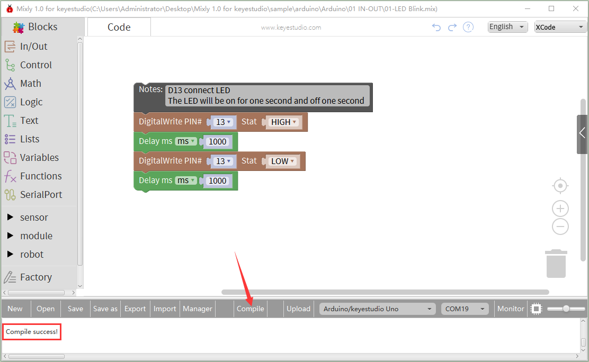
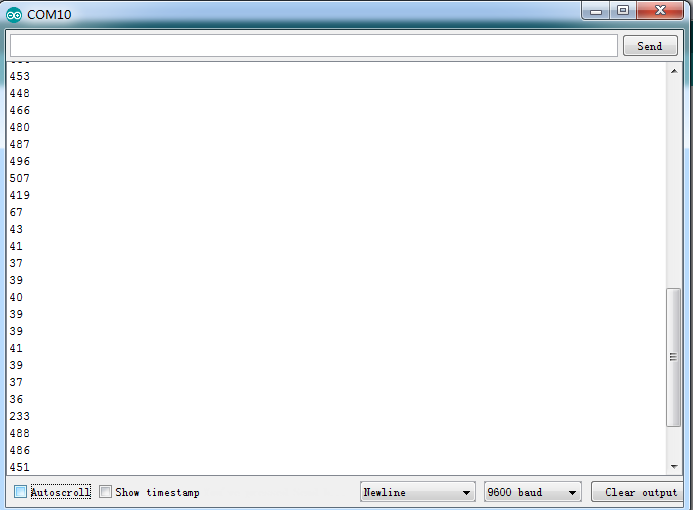
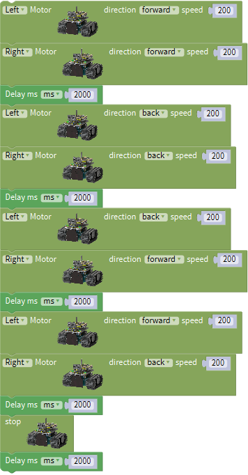
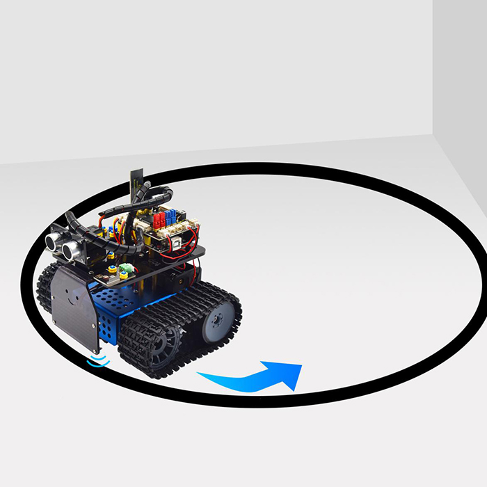
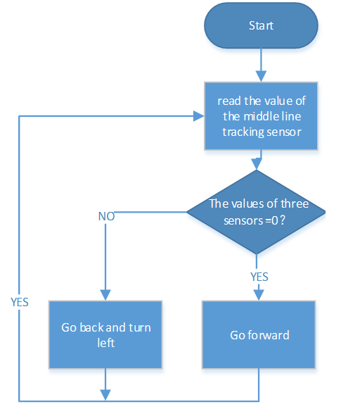
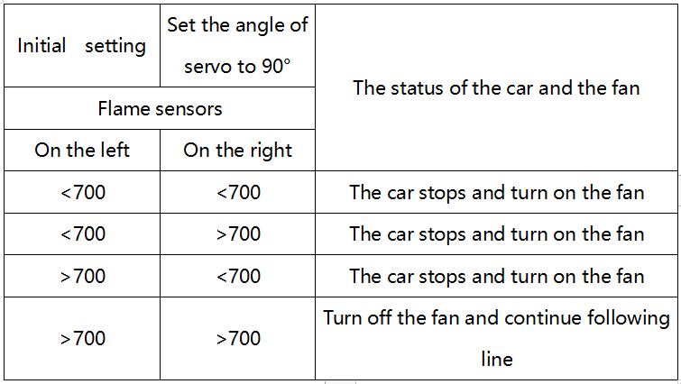
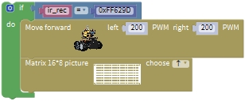
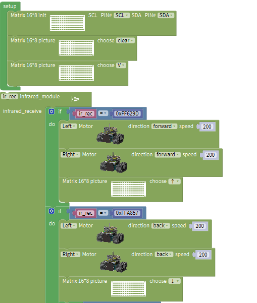

# KS0526 Keyestudio Mini Tank Robot V3 Mixly

Thanks for your support on our products. We will continue to provide you with higher quality products and better services\!

#     **About keyestudio**

1.  Keyestudio is a best-selling brand owned by KEYES Corporation, our product lines range from Arduino boards, shields, sensor modules, Raspberry Pi, micro:bit extension boards and smart car to complete starter kits designed for customers of any level to learn Arduino knowledge.
    
2.  All of our products comply with international quality standards and are greatly appreciated in a variety of different markets throughout the world.
    
3.  Welcome check more contents from our official website:

4.  <http:/www.keyestudio.com>
    
    \*References and After-sales Service

5.  Download Profile：https:/fs.keyestudio.com/KS0526

6.  Feel free to contact us please, if there is missing part or you encounter some troubles. Welcome to send email to
    us：**[service@keyestudio.com](http:/m.138.gz.cn/webadmin/~CAmsnCrrNXhTAySKCerrIfWjjZuuWVfI/~/usr/mod_edituser.jsp?;uid=service@keyestudio.com;;clearCache=).** We will update projects and products continuously based on your sincere advice.
    
    \*Warning

1.  This product contains tiny parts(screws, copper pillars), keep it out of reach of children under 7 years old please.
    
2.  This product contains conductive parts (control board and electronic module). Please operate according to the requirements of this tutorial. Improper operation may cause overheating and damage parts. Do not touch and immediately disconnect the circuit power.

# **Copyright**

The keyestudio trademark and logo are the copyright of KEYES DIY ROBOT co.,LTD. All products under keyestudio brand can’t be copied, sold and resold without authorization by anyone or company. If you’re interested in our items, please contact to our sales representatives: [**fennie@keyestudio.com**](http:/m.138.gz.cn/webadmin/~CAmsnCrrNXhTAySKCerrIfWjjZuuWVfI/~/usr/mod_edituser.jsp?;uid=fennie@keyestudio.com;;clearCache=)

**Mini Tank Robot V3(Mixly toturial)**

# **1. Introduction**

This STEM educational V3.0 tank robot is newly upgraded, adding an line-tracking and a fire- extinguishing function. It vigorously enhances the relationship between kids and parents, and sparks children’s imagination through programming and coding.

In the course of assembly process, you can see its multiple functions like light following, line tracking, IR and BT remote control, speed adjustment and so on. Additionally, there are some small parts that can help you assemble the robot car.

There are basic sensors and modules, such as a flame sensor, a BT sensor, an obstacle avoidance sensor, an line tracking sensor and an ultrasonic sensor are included.

The two tutorials for C language and Arduino are also suitable for the enthusiasts at different ages. It is really a best choice for you.

# **2.Features：**

1.Multiple functions：Confinement, line tracking, fire extingushing, light following, IR and BT remote control, speed control and so on

2\. Easy to build: assemble the robot with tiny parts

3\. High tenacity: Aluminum alloy brackets, metal motors, high quality wheels

4\. High extension: connect many sensors and modules through motor driver shield and sensor shield.

5\. Multiple controls: IR remote control, App control(iOS and Android system)

6.Basic programming：Mixly software

# **3.Parameters：**

Working voltage: 5v

Input voltage: 7-12V

Maximum output current: 2A

Maximum power dissipation: 25W (T=75℃)

Motor speed: 5V 200 rpm/min

Motor drive mode: dual H bridge drive(L298P)

Ultrasonic induction angle: \<15 degrees

Ultrasonic detection distance: 2cm-300cm

Infrared remote control distance: 10 meters (measured)

BT remote control distance: 30 meters (measured)

# **4.Kit List**

| #    | Picture                                                      | Name                                                      | QTY  |
| ---- | ------------------------------------------------------------ | --------------------------------------------------------- | ---- |
| 1    |   | Wrench                                                    | 1    |
| 2    |                     | Driving Wheels                                            | 2    |
| 3    |   | M4*12mm Hexagon Screws                                    | 2    |
| 4    |   | Caterpillar Band                                          | 2    |
| 5    |   | Driven Wheel                                              | 2    |
| 6    |   | M4*35mm Hexagon Screws                                    | 2    |
| 7    |   | Bottom Parts                                              | 1    |
| 8    |   | Tank Robot Chassis                                        | 1    |
| 9    |   | Keyestudio V4.0 Development Board                         | 1    |
| 10   |   | L298P Motor Driver Shield                                 | 1    |
| 11   |   | Keyestudio HM-10 BT-4.0                                   | 1    |
| 12   |   | HC-SR04 Ultrasonic Sensor                                 | 1    |
| 13   |   | Keyestudio 8*16 LED Panel                                 | 1    |
| 14   |   | Yellow LED Module                                         | 1    |
| 15   |   | Flame Sensor                                              | 2    |
| 16   |   | 130 Motor Module                                          | 1    |
| 17   |   | IR Receiver Module                                        | 1    |
| 18   |   | Photoresistor                                             | 2    |
| 19   |   | Acrylic Board for8*16 LED Panel                           | 1    |
| 20   |   | Upper Board                                               | 1    |
| 21   |  | Acrylic Board                                             | 2    |
| 22   |   | Keyestudio JMFP-4 17-KeyRemote Control(Without Batteries) | 1    |
| 23   |   | Keyestudio 9G 180 °Servo                                  | 1    |
| 24   |   | USB Cable                                                 | 1    |
| 25   |   | 3.0*40MM Screwdriver                                      | 1    |
| 26   |   | 4P M-F PH2.0mm to 2.54 Dupont Wire(Green-Blue-Red-Black)  | 1    |
| 27   |                    | 4P HX-2.54 Dupont Wire (Black-Red-White-Brown)            | 1    |
| 28   |   | 5P JST-PH2.0MM Dupont Wire                                | 1    |
| 29   |   | 3P-3P XH2.54 to 2.54 Dupont Wire（Yellow-Red-Black)       | 1    |
| 29   |   | 3P-3P XH2.54 to PH2.0 Dupont Wire（Yellow-Red-Black)      | 3    |
| 30   |   | 4P-3P XH2.54 to PH2.0  Dupont Wire（Yellow-Red-Black)     | 2    |
| 31   |   | 4P XH2.54 to PH2.0Dupont Wire（Green-Blue-Red-Black)      | 1    |
| 32   |   | M1.4*8MM Round-head Screws                                | 6    |
| 33   |   | M1.4 Nuts                                                 | 6    |
| 34   |                   | M2 Nuts                                                   | 8    |
| 35   |  | M2*8MM Round-head Screws                                  | 8    |
| 36   |   | M1.2*5MM Round-head Screws                                | 6    |
| 37   |   | M3*6MM Round-head Screws                                  | 18   |
| 38   |   | M3*10MM Round-head Screws                                 | 3    |
| 39   |                    | M3 Nuts                                                   | 3    |
| 40   |   | M3*10MM Dual-pass Copper Pillar                           | 4    |
| 41   |   | M3*40MM Dual-pass Copper Pillar                           | 4    |
| 42   |   | 43093 Blue Technic Axle Pin with Friction Ridges          | 13   |
| 43   |                    | 4265c Technic Bush                                        | 13   |
| 44   |  | Winding Pipe                                              | .12  |
| 45   |  | 3*100MM Ties                                              | 5    |
| 46   |                   | L Type M2.5 Wrench                                        | 1    |
| 47   |                    | L Type M3 Wrench                                          | 1    |
| 48   |                                    | L Type M1.5 Wrench                                        | 1    |
| 49   |  | Cardboard                                                 | 1    |

# **5.Installation**

It is recommended to start the installation part after all projects are learned.

## **Caution**

Set the initial angle of the servo Peel thin films off boards before installing this robot.

## **Step 1**

1.Required Parts

2.install

## **Step 2**

1.Required  Parts

2.install

## **Step 3**

1.Required  Parts

2.install

## **Step 4**

1.Required  Parts

2.install

## **Step 5**

1.Required  Parts

2.install

## **Step 6**

1.Required  Parts

2.install

## **Step 7**

1.Required  Parts

2.install

## **Step 8**

1.Required  Parts

2.install

(Note: The direction of jumper caps)
 

## **Step 9**

1.Required  Parts

2.install

## **Step 10**

1.Required  Parts

2.install

## **Step 11**

1.Required  Parts  

2.install

（Need to adjust the angle of the servo）

Find the code file for setting the servo to 90 degrees through the path and open it.

Code image：

Servo will first rotate from 0 to 180 degrees and then return to 90 degrees.

install：

## **Step 12**

1.Required  Parts  

2.install

## **Wiring up**

1.Hook Up the photo-resistor

2.Wire up the line tracking sensor

3.Hook up the IR Receiver Module

4.Wire up the Ultrasonic Sensor

5.Wire up the Servo

6.Hook Up the 8*16LED Panel

7.Motor and power wiring

## **Tank robot for extinguishing fire**

1.Dismantle two photoresistors and ultrasonic sensor, as shown below.

2.Replace them with a fan module and two flame sensors.

Then we get a tank robot for extinguishing fire.

3.Connection Diagram

Hook up the fan module and two flame sensors.

# **6.Install Mixly Software and Driver**

## **1.Download and Install Mixly**

### **①Description**

Mixly is a free open-source graphical Arduino programming software, based on Google’s Blockly graphical programming framework, and developed by Mixly Team@ BNU.

It is a complete support ecosystem for creative e-education, a stage for maker educators to realize their dreams.

### **② Download Mixly1.0**

Windows System：<https:/fs.keyestudio.com/Mixly1-Windows>

MACOS System：<https:/fs.keyestudio.com/Mixly1-MACOS>

We will take Mixly1.0 (Windows version) as example, and the installation method of MAC version is similar with it.

You will get installation package after downloading. As shown below:

Unzip the package, you will see “Mixly 1.0 for keyestudio.exe”

Double-click ”Mixly 1.0 for keyestudio.exe”, the following interface pops up.

We have to choose correct Arduino development board and name, as shown below:

Select correct COM port(the corresponding port will be shown after installing driver successfully)

You have to know the function of every area and interface on Mixly software before uploading program on Arduino development board

## **2.Keyestudio V4.0 Development Board**

We need to know keyestudio V4.0 development board, as a core of this smart car.

Keyestudio V4.0 development board is an Arduino uno compatible board, which is based on ATmega328P MCU, and with a cp2102 Chip as a UART-to-USB converter. 

It has 14 digital input/output pins (of which 6 can be used as PWM outputs), 6 analog inputs, a 16 MHz quartz crystal, a USB connection, a power jack, 2 ICSP headers and a reset button.

It contains everything needed to support the microcontroller; simply connect it to a computer with a USB cable or power it via an external DC power jack (DC 7-12V) or via female headers Vin/ GND(DC 7-12V) to get started.

<table>
<tbody>
<tr class="odd">
<td>Microcontroller</td>
<td>ATmega328P-PU</td>
</tr>
<tr class="even">
<td>Operating Voltage</td>
<td>5V</td>
</tr>
<tr class="odd">
<td>Input Voltage (recommended)</td>
<td>DC7-12V</td>
</tr>
<tr class="even">
<td>Digital I/O Pins</td>
<td>
14 (D0-D13)

(of which 6 provide PWM output)
</td>
</tr>
<tr class="odd">
<td>PWM Digital I/O Pins</td>
<td>6 (D3, D5, D6, D9, D10, D11)</td>
</tr>
<tr class="even">
<td>Analog Input Pins</td>
<td>6 (A0-A5)</td>
</tr>
<tr class="odd">
<td>DC Current per I/O Pin</td>
<td>20 mA</td>
</tr>
<tr class="even">
<td>DC Current for 3.3V Pin</td>
<td>50 mA</td>
</tr>
<tr class="odd">
<td>Flash Memory</td>
<td>32 KB (ATmega328P-PU) of which 0.5 KB used by bootloader</td>
</tr>
<tr class="even">
<td>SRAM</td>
<td>2 KB (ATmega328P-PU)</td>
</tr>
<tr class="odd">
<td>EEPROM</td>
<td>1 KB (ATmega328P-PU)</td>
</tr>
<tr class="even">
<td>Clock Speed</td>
<td>16 MHz</td>
</tr>
<tr class="odd">
<td>LED_BUILTIN</td>
<td>D13</td>
</tr>
</tbody>
</table>
## **3.Installing V4.0 board Driver**

Let’s install the driver of keyestudio V4.0 board. The USB-TTL chip on V4.0 board adopts CP2102 serial chip. The driver program of this chip is included in Arduino 1.8 version and above, which is convenient. Plug on USB port of board, the computer can recognize the hardware and automatically install the driver of CP2102.

If install unsuccessfully, or you intend to install manually, open the device manager of computer. Right click Computer----- Properties----- Device Manager

There is a yellow exclamation mark on the page, which implies installing unsuccessfully. Then we double click the hardware and update the driver.

Click “OK” to enter the following page, click “browse my computer for updated driver software”, find out the installed or downloaded ARDUINO software. As shown below:

There is a DRIVERS folder in Arduino software installed package（), open driver folder and you can see
the driver of CP210X series chips.

We click “Browse”, then find out the driver folder, or you could enter “driver” to search in rectangular box, then click “next”, the driver will be installed successfully. (I place Arduino software folder on the desktop, you could follow my way)

Open device manager, we will find the yellow exclamation mark disappear. The driver of CP2102 is installed successfully.

> 

## **4.Start the first program**

Click “Open”→ sample → arduino→ Arduino → 01 IN-OUT→01-LED Blink.mix

The corresponding board and COM port will be shown after setting board and COM port.

Click **Compile** to start compiling the program, check errors.

Click **Upload** to upload the program, upload successfully.

After uploading the program successfully, the onboard LED lights up for 1s, lights off for 1s. Congratulations, you finish the first program.

# **7.Projects：**

Note: (G), marked on each sensor and module, is the negative pole and connected to“G”, ”-”or “GND”on the sensor shield or control board ; (V) is the positive pole and linked with V , VCC, + or 5V on the sensor shield or control board.

## **Project 1: LED Blinks**

### (1) Description：

For starters and enthusiasts, LED Blink is a fundamental program. LED, the abbreviation of light emitting diodes, consists of Ga, As, P, N chemical compounds and so on. The LED can flash in diverse colors by altering the delay time in the test code. When in control, power on GND and VCC, the LED will be on if S end is in high level; nevertheless, it will go off.

### (2)Parameters：

Control interface: digital port

Working voltage: DC 3.3-5V

Pin spacing: 2.54mm

LED display color: yellow

### (3) Components Needed:

| Keyestudio V4.0 Development Board *1                | L298P Motor Driver Shield*1 | Yellow LED Module*1        |
| --------------------------------------------------- | --------------------------- | -------------------------- |
|                           |   |  |
| 3P-3P XH2.54 to 2.54 Dupont Wire（Yellow-Red-Black) | USB Cable*1                 |                            |
|                           |   |                            |

### (4) Motor Drive Shield V2：

There are many ways to drive a motor. Our robot car uses the most common solution--L298P--which is an excellent high-power motor driver IC produced by STMicroelectronics. It can directly drive DC motors, two-phase and four-phase stepping motors. The driving current is up to 2A, and the output terminal of motor adopts eight high-speed Schottky diodes as protection.

We designed a shield based on the circuit of L298p.

The stacked design reduces the technical difficulty of using and driving the motor.

5)  ### Connection Diagram：

LED is connected to D3 port, and remember to install jumper caps onto the shield

### (6)Test Code：

The program will be generated if you find the following file and drag it into Mixly software.

| File Type | Route                                                  | File Name               |
| --------- | ------------------------------------------------------ | ----------------------- |
| MIX File  | ../tutorial for Mixly/Mixly Code/lesson\_1\_LED Blinks | lesson\_1.1\_LED Blinks |
|           |                                                        |                         |

You could edit code step by step as follows:

（1）Click“robot”to choose Mini Tank Robot V3

（2）To find and drag and the S end of yellow LED is connected to D3 of sensor shield

（3）Copy  once，click the little triangle behind“HIGH”to choose”HIGH”，and others remain unchanged; click “Control”to find and drag and keep it the same; 

Copy once，click the little triangle behind “HIGH” to choose“LOW”，and others remain unchanged;

**Complete code：**

### (7) Test Results：

Upload the program, LED blinks at the interval of 1s.

### （8）Extension Practice：

We have succeeded in blinking LED. Next, let’s observe what will happen to the LED if we modify pins and delay time.

The program will be generated if you find the following file and drag it into Mixly software.

| File Type | Route                                                  | File Name               |
| --------- | ------------------------------------------------------ | ----------------------- |
| MIX File  | ../tutorial for Mixly/Mixly Code/lesson\_2\_LED Blinks | lesson\_1.2\_LED Blinks |
|           |                                                        |                         |

You could edit code step by step as follows:

Complete Program：

The LED flickers faster through the test result, therefore, pins and delay time affect flash frequency.

## **Project 2: Adjust LED Brightness**

### (1) Description：

In previous lesson, we control LED on and off and make it blink.

In this project, we will control LED’s brightness through PWM simulating breathing effect. Similarly, you can change the step length and delay time in the code so as to demonstrate different breathing effects.

PWM is a means of controlling the analog output via digital means. Digital control is used to generate square waves with different duty cycles (a signal that constantly switches between high and low levels) to control the analog output.In general, the input voltages of ports are 0V and 5V. What if the 3V is required? Or a switch among 1V, 3V and 3.5V? We cannot change resistors constantly. For this reason, we resort to PWM.

For Arduino digital port voltage outputs, there are only LOW and HIGH levels, which correspond to the voltage outputs of 0V and 5V respectively. You can define LOW as“0”and HIGH as“1’, and let the Arduino output five hundred‘0’or‘1’within 1 second. If output five hundred‘1’, that is 5V; if all of which is‘0’,that is 0V; if output 25001 pattern, that is 2.5V.

This process can be likened to showing a movie. The movie we watch are not completely continuous. Actually, it generates 25 pictures per second, which cannot be told by human eyes. Therefore, we mistake it as a continuous process. PWM works in the same way. To output different voltages, we need to control the ratio of 0 and 1. The more ‘0’or‘1’ output per unit time, the more accurate the control.

PWM is a technology to obtain analog quantity through digital method. Digital control forms a square wave, and the square wave signal only has two states of turning on and off (that is, high or low levels). By controlling the ratio of the duration of turning on and off, a voltage varying from 0 to 5V can be simulated. The time turning on(academically referred to as high level) is called pulse width, so PWM is also called pulse width modulation.

Through the following five square waves, let’s acknowledge more about PWM.

In the above figure, the green line represents a period, and value of analogWrite() corresponds to a percentage which is called Duty Cycle as well. Duty cycle implies that high-level duration is divided by low-level duration in a cycle. From top to bottom, the duty cycle of first square wave is 0% and its corresponding value is 0. The LED brightness is lowest, that is, turn off. The more time high level lasts, the brighter the LED. Therefore, the last duty cycle is 100%, which correspond to 255, LED is brightest. 25% means darker.

PWM mostly is used for adjusting the LED brightness or rotation speed of motor.

It plays vital role in controlling smart robot car. I believe that you can’t wait to enter next project.

### (2) Parameters：

Control interface: Digital port 3

Working voltage: DC 3.3-5V

Pin spacing: 2.54mm

LED display color: yellow

(3)Components Needed:：

| Keyestudio V4.0 Development Board *1                         | L298P Motor Driver Shield*1                                  | Yellow LED Module*1                                          |
| ------------------------------------------------------------ | ------------------------------------------------------------ | ------------------------------------------------------------ |
|  |  |  |
| 3P-3P XH2.54 to 2.54 Dupont Wire（Yellow-Red-Black)*1        | USB Cable*1                                                  |                                                              |
|  |  |                                                              |

### (4)Connection Diagram：

### (5)Test Code：

The program will be generated if you find the following file and drag it into Mixly software.

|           |                                                                   |                                    |
| --------- | ----------------------------------------------------------------- | ---------------------------------- |
| File Type | Route                                                             | File Name                          |
| MIX File  | ../tutorial for Mixly/Mixly Code/lesson\_2\_Adjust LED Brightness | lesson\_2.1\_Adjust LED Brightness |

You could edit code step by step as follows:

（1）Click"Control"to find and drag，change the 1
in front of “to” to 0， the 10 behind“to”to 255，and others remain unchanged;

（2）Click“Mini Tank Robot V3”of “robot”to find and drag，and alter the default “255”according to the PMW to output;

(3) Click to change 255 to i：;

(4) Click “Control”to find and draginto; change delay in 1000ms to 5ms; 

（5）Copy once， change the 0 before “to”to 255, the 255 to 0，and the 1 behind step to -1，and others remain unchanged;

**Complete code：**

### (6)Test Results：

Upload test code successfully, LED gradually changes from bright to dark, like human’s breath, rather than turning on and off immediately.

### (7）Extension Practice：

Let’s modify the value of delay and remain the pin unchanged, then observe how LED changes.

The program will be generated if you find the following file and drag it into Mixly software.

| File Type | Route                                                        | File Name                          |
| --------- | ------------------------------------------------------------ | ---------------------------------- |
| MIX File  | ../tutorial for Mixly/Mixly Code/lesson\_2\_Adjust LED Brightness | lesson\_2.2\_Adjust LED Brightness |
|           |                                                              |                                    |

You could edit code step by step as follows:

**Complete code：**

Upload the code to development board, LED flashes more slowly.

## **Project 3: Photoresistor**

### (1) Description：

The photosensitive resistor is a special resistor made of a semiconductor material such as a sulfide or selenium, and a moisture-proof resin is also coated with a photoconductive effect. The photosensitive resistance is most sensitive to the ambient light, different illumination strength, and the resistance of the photosensitive resistance is different. We use the photosensitive
resistance to design the photosensitive resistor module. The module signal is connected to the microcontroller analog port. 

When the light intensity is stronger, the larger the analog port voltage, that is, the simulation value of the microcontroller is also large; in turn, when the light intensity is weaker, the smaller the analog port voltage, that is, the simulation value of the microcontroller is also small. . In this way, we can read the corresponding analog value using the photosensitive resistor module, and the intensity of the light in the inductive environment.

### (2)Parameters：

Photosensitive resistance resistance value: 5K Ou-0.5m

Interface type: simulation port A0, A1

Working voltage: 3.3V-5V

Pin spacing: 2.54mm

### (3)Components Needed:：

| Keyestudio V4.0 Development Board *1                         | L298P Motor Driver Shield*1                                  | Yellow LED Module*1                                          | 3P-3P XH2.54 to 2.54 Dupont Wire（Yellow-Red-Black)*1        |
| ------------------------------------------------------------ | ------------------------------------------------------------ | ------------------------------------------------------------ | ------------------------------------------------------------ |
|  |  |  |  |
| Photoresistor *1                                             | 3P-3P XH2.54 to PH2.0 Dupont Wire（Yellow-Red-Black)*1       | USB Cable*1                                                  |                                                              |
|  |  |                                    |                                                              |

### (4)Connection Diagram

We connect a photoresistor to A0 and make an experiment. Let’s read its analog value first.

### (5)Test Code：

The program will be generated if you find the following file and drag it into Mixly software.

| File Type | Route                                                      | File Name                   |
| --------- | ---------------------------------------------------------- | --------------------------- |
| MIX File  | ../tutorial for Mixly/Mixly Code/lesson\_3\_ Photoresistor | lesson\_3.1\_ Photoresistor |
|           |                                                            |                             |

You could edit code step by step as follows:

（1）Click “Control”to find and drag; please note that the code in only runs once;

（2）Click“Serial”to find and draginto;

（3）Click“Mini Tank Robot V3”of “robot”to find and drag，click the little triangle behind“Left”to choose “Left”(if A1 is connected then choose “Right”.)

（4）Click“SerialPort”to find and drag and drag  to it：;

（5）Click “Control”to find and drag and change delay in 1000ms to 100ms:

**Complete code：**

### (6)Test Results：

Upload test code to the development board and open serial port monitor.

When covering it, the value gets smaller; if not, the value gets larger.

### (7)Extension Practice:

We know the value of the photoresistor. How about controlling the LED’s brightness by it?

The LED’s brightness is controlled by PWM. Therefore, we connect the LED to PMW pin(pin 3) of the shield.

The program will be generated if you find the following file and drag it into Mixly software.

| File Type | Route                                                      | File Name                  |
| --------- | ---------------------------------------------------------- | -------------------------- |
| MIX File  | ../tutorial for Mixly/Mixly Code/lesson\_3\_ Photoresistor | lesson\_3.2\_Photoresistor |
|           |                                                            |                            |

You could edit code step by step as follows:

（1）Click “Control”to find and drag;

（2）Click“serial”to find and draginto;

（3）Click“Mini Tank Robot V3”of “robot”to find and drag，;

（4）Click“SerialPort”to find and drag

（5）Click“Mini Tank Robot V3”of “robot”to find and draginto中; click the little triangle to choose Left（if A1is connected then choose Right):

;

（6）click“Math”to find and drag to the 0 behind value; copy of  and place it in front of from; change the 1 in front of “to”to 0,  100 to 1023；change the 1behind “to” to 0，1000 to 255;

（7）Click “Control”to find and drag，and change delay in 1000ms to 50ms;

**Complete code：**

Upload code to the development board, then cove the photoresistor and observe the LED’s brightness.

## **Project 4: Line Tracking Sensor**

### (1) Description：

The tracking sensor is actually an infrared sensor. The component used here is the TCRT5000 infrared tube.

Its working principle is to use different reflectivity of infrared light to colors, then convert the strength of the reflected signal into a current signal.

During the process of detection, black is active at HIGH level while white is active at LOW level. The detection height is 0-3 cm.

Keyestudio 3-channel line tracking module has integrated 3 sets of TCRT5000 infrared tube on a single board, which is more convenient for wiring and control.

By rotating the adjustable potentiometer on the sensor, it can adjust the detection sensitivity of the sensor.

### (2)Parameters：

Operating Voltage: 3.3-5V (DC)

Interface: 5PIN

Output Signal: Digital signal

Detection Height: 0-3 cm

Special note: before testing,rotate the potentiometer on the sensor to adjust the detection sensitivity. When adjust the LED at the threshold between ON and OFF, the sensitivity is the best.

### (3)Components Needed:

| Keyestudio V4.0 Development Board *1                         | L298P Motor Driver Shield                                    | Yellow LED Module*1                                          | 3P-3P XH2.54 to 2.54 Dupont Wire（Yellow-Red-Black)*1        |
| ------------------------------------------------------------ | ------------------------------------------------------------ | ------------------------------------------------------------ | ------------------------------------------------------------ |
|  |  |  |  |
| Tank Robot Chassis *1                                        | 5P JST-PH2.0MM Dupont Wire*1                                 | USB Cable*1                                                  |                                                              |
|  |  |  |                                                              |

Note: the line tracking sensor is installed under the bottom of the robot.

### (4)Connection Diagram：

### (5)Test Code：

The program will be generated if you find the following file and drag it into Mixly software.

| File Type | Route                                                        | File Name                         |
| --------- | ------------------------------------------------------------ | --------------------------------- |
| MIX File  | ../tutorial for Mixly/Mixly Code/lesson\_4\_Line Tracking Sensor | lesson\_4.1\_Line Tracking Sensor |
|           |                                                              |                                   |

You could edit code step by step as follows:

(1) Click“Variables”to find and dragand click”Math” to drag ;change item to L\_val、M\_val、R\_val and change “int”：;

（2）Click“Serial”to find and draginto;

（3）Click“Variables”to find and drag、and;click“Mini Tank Robot V3”of “Robot”to choose;copy it twice; click the little triangle to select“center_tracking”and“right_tracking”respectively and place them into the corresponding variable:;

（4）Click“SerialPort”to find and drag;

（5）Click“Variables”to find and drag、andinto;click“Text”to find and change “hello” to “  “(two spaces):;use for newline printing;

（6）Click “Control”to find and drag and change delay in 1000ms to 100ms.

**Complete code：**

### (6)Test Results：

Upload the code on development board, open serial monitor to check line tracking sensors. And the displayed value is 1(high level) when no signals are received. The value shifts into 0 when the sensor is covered with paper.

### (7)Extension Practice：

After knowing its working principle, you can connect an LED to D3 so as to control LED by line tracking sensor.

The program will be generated if you find the following file and drag it into Mixly software.

| File Type | Route                                                        | File Name                         |
| --------- | ------------------------------------------------------------ | --------------------------------- |
| MIX File  | ../tutorial for Mixly/Mixly Code/lesson\_4\_Line Tracking Sensor | lesson\_4.2\_Line Tracking Sensor |
|           |                                                              |                                   |

You could edit code step by step as follows:

**Complete code：**

## **Project 5: Flame Sensor**

### (1)Description：

The flame sensor uses IR receiving tube to detect flames, converts the brightness of the flame into signals with high and low levels, input them into the central processor. The corresponding program processing. In both flames close to and without flames, the voltage value of the analog port is varied.

If there is no flame, the analog port is about 0.3V; when there is a flame, the analog port is 1.0V. The closer the flame is , the more the voltage value is. It can be used to detect the fire source or make a smart robot.

Note the probe of flame sensors only bears the temperature between -25 ℃ and ～85℃

In the process of use, pay attention to keep the flame sensor in certain distance to avoid getting damaged.

### (2)Parameters：

Working voltage: 3.3V-5V (DC)

Current: 100mA

Maximum power: 0.5W

Work temperature: -10 ° C to +50 degrees Celsius

Sensor size: 31.6mmx23.7mm

Interface: 4pin turn 3PIN interface

Output signal: analog signals A1, A2

### (3)Components Needed:

| Keyestudio V4.0 Development Board *1                         | L298P Motor Driver Shield                                    | Yellow LED Module*1                                          | 3P-3P XH2.54 to 2.54 Dupont Wire（Yellow-Red-Black)*1        |
| ------------------------------------------------------------ | ------------------------------------------------------------ | ------------------------------------------------------------ | ------------------------------------------------------------ |
|  |  |  |  |
| Flame Sensor*1                                               | 4P-3P XH2.54 to PH2.0  Dupont Wire（Yellow-Red-Black)        | USB Cable*1                                                  |                                                              |
|  |  |  |                                                              |

### (4)Connection Diagram：

We can use two flame sensors to make a fire-distinguishing robot car. But in this experiment, we aim to read its analog value

### (5)Test Code：

The program will be generated if you find the following file and drag it into Mixly software.

| File Type | Route                                                    | File Name                 |
| --------- | -------------------------------------------------------- | ------------------------- |
| MIX File  | ../tutorial for Mixly/Mixly Code/lesson\_5\_Flame Sensor | lesson\_5.1\_Flame Sensor |
|           |                                                          |                           |

You could edit code step by step as follows:

（1）Click “Control”to find and drag;click”SerialPort” to draginto

;

（2）Click the “Mini Tank Robot V3”of “robot” to drag;click the little triangle of “Left” to select Left（if A1 is connected then select Right）;click“SerialPort”to find and dragand putinto;

（3）Click “Control”to find and drag and change delay in 1000ms to 100ms;

**Complete code：**

### (6)Test Results：

Wire up components, burn the code, open the serial monitor and set the baud rate to 9600.

You can view the simulation value of flame sensor.

The closer the flame, the smaller the simulation value.

Adjust the potentiometer on the module to maintain D1 at the critical point. When the sensor does not detect flame, the D1 will be off, but if the sensor detects flame, the D1 will be on.

### (7)Extension Practice:

Next, connect an LED to pin 3 and we can control it by a flame sensor, as shown below;

The program will be generated if you find the following file and drag it into Mixly software.

| File Type | Route                                                     | File Name                  |
| --------- | --------------------------------------------------------- | -------------------------- |
| MIX File  | ../tutorial for Mixly/Mixly Code/lesson\_5\_ Flame Sensor | lesson\_5.2\_ Flame Sensor |
|           |                                                           |                            |

You could edit code step by step as follows:

## **Project 6: Fan**

### (1) Description：

This fan module uses a HR1124S motor-controlling chip, a single-channel H-bridge driver chip containing a low-conductivity resistance PMOS and NMOS power tubes. The low-conducting resistance can ease the power consumption, contributing to the safe work of the chip for longer time.

In addition, its low standby current and low static working current makes itself apply to toys. We can control the rotation direction and speed of the fan by outputting IN + and IN- signals and PWM signals.

### (2)Parameters：

Working voltage: 5V

Current: 200mA

Maximum power: 2W

Work temperature: -10 ° C to +50 degrees Celsius

Size: 47.6mm \* 23.8mm

### (3)Components Needed:

| Keyestudio V4.0 Development Board *1                         | L298P Motor Driver Shield                                    | 130 Motor  *1                                                | 4P XH2.54 to PH2.0Dupont Wire（Green-Blue-Red-Black) *1      |
| ------------------------------------------------------------ | ------------------------------------------------------------ | ------------------------------------------------------------ | ------------------------------------------------------------ |
|  |  |  |  |
| Flame Sensor*1                                               | 4P-3P XH2.54 to PH2.0  Dupont Wire（Yellow-Red-Black)        | USB Cable*1                                                  | Tank Robot Chassis                                           |
|  |  |  |                                    |

The fan module needs driving by large current; therefore, we install a battery holder.

### (4)Connection Diagram

The pin GND, VCC, IN+ and IN- of the fan module are connected to pin G, V, 12 and 13 of the shield.

### (5)Test Code：

The program will be generated if you find the following file and drag it into Mixly software.

| File Type | Route                                           | File Name        |
| --------- | ----------------------------------------------- | ---------------- |
| MIX File  | ../tutorial for Mixly/Mixly Code/lesson\_6\_Fan | lesson\_6.1\_Fan |
|           |                                                 |                  |

You could edit code step by step as follows:

（1）Click the “Mini Tank Robot V3”of “robot”to drag; copy it twice; click the little triangle
of”forward” to select stop and back respectively;

（2）Click “Control”to find and drag and change delay in 1000ms to 2000ms.

**Complete code：**

### (4)Test Results：

Upload code, wire up components and plug in power. The small fan will turn clockwise for 2000ms, stop for 2000ms, and rotate anticlockwise for 2000ms.

### (5)Extension Practice:

We have understood the working principle of the flame sensor. Next, hook up a flame sensor to pin A0 as shown below. Then control the fan to blew out fire with the flame sensor.

The program will be generated if you find the following file and drag it into Mixly software.

| File Type | Route                                           | File Name        |
| --------- | ----------------------------------------------- | ---------------- |
| MIX File  | ../tutorial for Mixly/Mixly Code/lesson\_6\_Fan | lesson\_6.2\_Fan |
|           |                                                 |                  |

You could edit code step by step as follows:

## **Project 7: Servo Control**

### (1)Description

Servo motor is a position control rotary actuator. It mainly consists of a housing, a circuit board, a core-less motor, a gear and a position sensor. Its working principle is that the servo receives the signal sent by MCU or receiver and produces a reference signal with a period of 20ms and width of 1.5ms, then compares the acquired DC bias voltage to the voltage of the potentiometer and obtain the voltage difference output.

In general, servo has three lines in brown, red and orange. The brown wire is grounded, the red one is a positive pole line and the orange one is a signal line.

The rotation angle of servo motor is controlled by regulating the duty cycle of PWM (Pulse-Width Modulation) signal. The standard cycle of PWM signal is 20ms (50Hz). Theoretically, the width is distributed between 1ms-2ms, but in fact, it's between 0.5ms-2.5ms. The width corresponds the rotation angle from 0° to 180°. But note that for different brand motors, the same signal may have different rotation angles. 

The angle of the servo:

### (2)Parameters：

Working voltage: DC 4.8V \~ 6V

Operating angle range: about 180 ° (at 500 → 2500 μsec)

Pulse width range: 500 → 2500 μsec

No-load speed: 0.12 ± 0.01 sec / 60 (DC 4.8V) 0.1 ± 0.01 sec / 60 (DC 6V)

No-load current: 200 ± 20mA (DC 4.8V) 220 ± 20mA (DC 6V)

Stopping torque: 1.3 ± 0.01kg · cm (DC 4.8V) 1.5 ± 0.1kg · cm (DC 6V)

Stop current: ≦ 850mA (DC 4.8V) ≦ 1000mA (DC 6V)

Standby current: 3 ± 1mA (DC 4.8V) 4 ± 1mA (DC 6V)

### (3) Components Needed:

| Keyestudio V4.0 Development Board *1                         | L298P Motor Driver Shield                                    | Yellow LED Module*1                                          | 3P-3P XH2.54 to 2.54 Dupont Wire（Yellow-Red-Black)*1        |
| ------------------------------------------------------------ | ------------------------------------------------------------ | ------------------------------------------------------------ | ------------------------------------------------------------ |
|  |  |  |  |
| HC-SR04 Ultrasonic Sensor*1                                  | 4P M-F PH2.0mm to 2.54 Dupont Wire                           | USB Cable*1                                                  | Tank Robot Chassis *1                                        |
|  |  |  |                                    |

### (4) Connection Diagram：

Note: The brown, red and orange wire of the servo are respectively attached to Gnd(G), 5v(V) and 10 of the shield. Remember to connect an external power because of the high current of the servo. If not, the development board will be burnt out.

### (5)Test Code：

The program will be generated if you find the following file and drag it into Mixly software.

| File Type | Route                                                     | File Name                |
| --------- | --------------------------------------------------------- | ------------------------ |
| MIX File  | ../tutorial for Mixly/Mixly Code/lesson\_7\_Servo Control | lesson\_7\_Servo Control |
|           |                                                           |                          |

You could edit code step by step as follows:

（1）Click“Mini Tank Robot V3”of “robot”to find and drag; the number is the angle of the servo;

（2）Click of “Control”to set the default time delay in 1000ms:

 ;

（3）Copy  three times and change the 0 to 90,180 and 0 respectively;and others remain unchanged;

**Complete code：**

### (6)Test Results：

After uploading the test code and powering it up, the servo rotates to the angle of 90°,180° and 0° and repeats this pattern.

## **Project 8: Ultrasonic Sensor**

### (1)Description：

The HC-SR04 ultrasonic sensor uses sonar to determine distance to an object like bats do. It offers excellent non-contact range detection with high accuracy and stable readings in an easy-to-use package. It comes complete with ultrasonic transmitter and
receiver modules.

The HC-SR04 or the ultrasonic sensor is being used in a wide range of electronics projects for creating obstacle detection and distance measuring application as well as various other applications. Here we have brought the simple method to measure the distance with arduino and ultrasonic sensor and how to use ultrasonic sensor with arduino.

### (2) Specification

Power Supply :+5V DC

Quiescent Current : \<2mA

Working Current: 15mA

Effectual Angle: \<15°

Ranging Distance : 2cm – 400 cm

Resolution : 0.3 cm

Measuring Angle: 30 degree

Trigger Input Pulse width: 10uS

### (3) Components Needed:

| Keyestudio V4.0 Development Board *1                         | L298P Motor Driver Shield                                    | Yellow LED Module*1                                          | 3P-3P XH2.54 to 2.54 Dupont Wire（Yellow-Red-Black)*1        |
| ------------------------------------------------------------ | ------------------------------------------------------------ | ------------------------------------------------------------ | ------------------------------------------------------------ |
|  |  |  |  |
| HC-SR04 Ultrasonic Sensor*1                                  | 4P M-F PH2.0mm to 2.54 Dupont Wire                           | USB Cable*1                                                  | Tank Robot Chassis *1                                        |
|  |  |  |                                    |

### (4) The principle of ultrasonic sensor

As the above picture shown, it is like two eyes. One is transmitting end, the other is receiving end.

The ultrasonic module will emit the ultrasonic waves after triggering a signal. When the ultrasonic waves encounter the object and are reflected back, the module outputs an echo signal, so it can determine the distance of the object from the time difference between the trigger signal and echo signal.

The t is the time that emitting signal meets obstacle and returns. And the propagation speed of sound in the air is about 343m/s, and distance = speed \* time. However, the ultrasonic wave emits and comes back, which is 2 times of distance. Therefore, it needs to be divided by 2, the distance measured by ultrasonic wave = (speed \* time)/2

1. Use method and timing chart of ultrasonic module:

2. Setting the delay time of Trig pin of SR04 to 10μs at least, which can trigger it to detect distance.

3. 2\. After triggering, the module will automatically send eight 40KHz ultrasonic pulses and detect whether there is a signal return. This step will be completed automatically by the module.

4. 3\. If the signal returns, the Echo pin will output a high level, and the duration of the high level is the time from the transmission of the ultrasonic wave to the return.

   

Circuit diagram of ultrasonic sensor:

4. **Connection Diagram：**

Note: The pin VCC, Trig, Echo and Gnd of the ultrasonic sensor are respectively connected to 5v(V), 12(S), 13(S) and Gnd(G) of the shield

### (5)Test Code：

The program will be generated if you find the following file and drag it into Mixly software.

| File Type | Route                                                        | File Name                      |
| --------- | ------------------------------------------------------------ | ------------------------------ |
| MIX File  | ../tutorial for Mixly/Mixly Code/lesson\_8\_Ultrasonic Sensor | lesson\_8.1\_Ultrasonic Sensor |
|           |                                                              |                                |

You could edit code step by step as follows:

（1）Click “Control”to find and drag;

（2）Click“Serial”to find and draginto;

（3）Click“Variables”to find and drag;click“Math”to find and drag behind value; change item to distance 1 and distance 2 respectively:

 ;

（4）Click“Variables”to find and drag;click“Mini Tank Robot V3”of “robot”to find and draginto and others remain unchanged;

（5）Click“Variables”to find and drag;click“Math”to find and draginto; click “Variables”to find and draginto the 1 on the left of“+”; change the 1 on the right of“+”to 0.3937; and click the little triangle behind “+”to choose“×”:

;

（6）Click“SerialPort”to find and drag; click "Variables" to find and drag into:

;

（7）Click“SerialPort”to find and drag; click“text”to find and draginto; and change hello to cm:

;

（8）Copy once; change distance1 to distance2 and cm to in:

;

（9）Click “Control”to find and drag and change delay in 1000ms to 100ms:

 ;

**Complete code：**

### (6)Test Results：

Upload test code on the development board, open serial monitor and set baud rate to 9600. The detected distance will be displayed, and the unit is cm and inch. Hinder the ultrasonic sensor by hand, the displayed distance value gets smaller.

### (7)Extension Practice:

We have just measured the distance displayed by the ultrasonic. How about controlling the LED with the measured distance? Let's try it and connect an LED light module to the D3 pin.

The program will be generated if you find the following file and drag it into Mixly software.

| File Type | Route                                                        | File Name                      |
| --------- | ------------------------------------------------------------ | ------------------------------ |
| MIX File  | ../tutorial for Mixly/Mixly Code/lesson\_8\_Ultrasonic Sensor | lesson\_8.2\_Ultrasonic Sensor |
|           |                                                              |                                |

You could edit code step by step as follows:

（1）Click “Control”to find and drag;

（2）Click“SerialPort”to find and draginto:

;

（3）Click“Variables”to find and drag twice into; click”Math”to find and drag twice behind value; and change item to distance 1 and distance 2:

 ;

（4）Click“Variables” to find and drag; click“Mini Tank Robot V3”of “robot”to find and drag into:

​     ;

（5）Click“Variables”to find and drag; click“Math”to find and draginto; click “Variables”to find and drag to the 1 on the left of +”; change the 1 on the right of “+” to 0.3937; and click the little triangle behind “+” to choose“×”:

​     ;

（6）Click“SerialPort”to find and drag;click "Variables"to find and draginto:

​     ;

（7）Click”Serial”to find and drag; click”Text”to find and draginto; and change hello to cm:

​     ;

（8）Copy  once; change distance1 to distance2 and in to cm:

​     ;

（9）Click “Control”to find and drag and change delay in 1000ms to 100ms:。

​      ;

（10）（10）Click"Control" to find and drag; click“logic”to find and drag behind the if of ; click “logic”to find and drag  into the left of “and”; click”Variables”to find and drag  into the left of “=”; click”Math”to drag to the right of“=”; change the 0 to 2;click the little triangle behind “=”to select“≥”; copy once behind “and “;click the little triangle behind“≥” to choose“≤”，and change 2 to 10:

​      ;

（11）Click“Mini Tank Robot V3”of “robot”to find and drag into do:

​    ;

**Complete code：**

Upload test code to development board, block ultrasonic

sensor by hand, and keep the distance between 2cm to 10cm, then check if LED is on

## **Project 9: IR Reception**

### (1)Description：

There is no doubt that infrared remote control is ubiquitous in daily life. It is used to control various household appliances, such as TVs, stereos, video recorders and satellite signal receivers. Infrared remote control is composed of infrared transmitting and infrared receiving systems, that is, an infrared remote control and infrared receiving module and a single-chip microcomputer capable of decoding.​    

The 38K infrared carrier signal emitted by remote controller is encoded by the encoding chip in the remote controller. It is composed of a section of pilot code, user code, user inverse code, data code, and data inverse code. The time interval of the pulse is used to distinguish whether it is a 0 or 1 signal and the encoding is made up of these 0, 1 signals.

The user code of the same remote control is unchanged while the data code can distinguish the key.

When the remote control button is pressed, the remote control sends out an infrared carrier signal. When the IR receiver receives the signal, the program will decode the carrier signal and determines which key is pressed. The MCU decodes the received 01 signal, thereby judging what key is pressed by the remote control.

Infrared receiver we use is an infrared receiver module. Mainly composed of an infrared receiver head, which is a device that integrates reception, amplification, and demodulation. Its internal IC has completed demodulation, and can achieve from infrared reception to output and be compatible with TTL signals. Additionally, it is suitable for infrared remote control and infrared data transmission. The infrared receiving module made by the receiver has only three pins, signal line, VCC and GND. It is very convenient to communicate with Arduino and other microcontrollers.

### (2)Parameters:

Operating Voltage: 3.3-5V（DC）

Interface: 3PIN

Output Signal: Digital signal

Receiving Angle: 90 degrees

Frequency: 38khz

Receiving Distance: 10m

### (3)Components Needed:

| Keyestudio V4.0 Development Board *1                         | L298P Motor Driver Shield*1                                  | Yellow LED Module*1                                          | 3P-3P XH2.54 to 2.54 Dupont Wire（Yellow-Red-Black)*1        |
| ------------------------------------------------------------ | ------------------------------------------------------------ | ------------------------------------------------------------ | ------------------------------------------------------------ |
|  |  |  |  |
| IR Receiver Module *1                                        | 3P-3P XH2.54 to PH2.0 Dupont Wire（Yellow-Red-Black)         | USB Cable                                                    | Tank Robot Chassis *1                                        |
|  |  |  |                                    |

### (4)Connection Diagram：

Note: the pin “-”,“+”and S of the IR receiver are respectively connected to pin G（GND）, V（VCC）and A2 of the sensor expansion board. On the condition that digital ports are not enough, the analog ports also can be served as digital ports. A0 is equal to the digital port 14, A1 means the digital port15.

### (5)Test Code：

The program will be generated if you find the following file and drag it into Mixly software.

| File Type | Route                                                    | File Name                 |
| --------- | -------------------------------------------------------- | ------------------------- |
| MIX File  | ../tutorial for Mixly/Mixly Code/lesson\_9\_IR Reception | lesson\_9.1\_IR Reception |
|           |                                                          |                           |

You could edit code step by step as follows:

（1）Click “Control”to find and drag;

（2）Click“Serial”to find and draginto:

;

（3）Click“Mini Tank Robot V3”of “robot”to find and drag;click  of “SerialPort” to choose default “hex”(represent for hexadecimal); click”Variables” to place  into :

​     .

Complete code：

### (6)Test Results：

Upload test code, open serial monitor and set baud rate to 9600, point remote control to IR receiver. Then the corresponding value will be shown. If holding down keys for a while, the error codes will appear.

Below we have listed out each key value of keyestudio remote control. So you can keep it for reference.

> 

### (7)Extension Practice:

We decoded the key value of IR remote control. How about controlling LED by the measured value? We could design an experiment.

Attach an LED to D3, then press the keys of remote control to make LED light on and off.

The program will be generated if you find the following file and drag it into Mixly software.

| File Type | Route                                                    | File Name                 |
| --------- | -------------------------------------------------------- | ------------------------- |
| MIX File  | ../tutorial for Mixly/Mixly Code/lesson\_9\_IR Reception | lesson\_9.2\_IR Reception |
|           |                                                          |                           |

You could edit code step by step as follows:

（1）Click “Control”to find and drag.

（2）Click“Serial”to find and draginto:

;

（3）Click“Mini Tank Robot V3”of “robot”to find and drag and choose the default “hex”;

（4）Click“Variables”to find and draginto;click “Math”to find and drag behind value; and change item to a:

​      ;

（5）Click “Control”to find ;click; drag  into to get ; click“Ligic”to find and drag behind if; click “Logic” to drag  to the left side of and; click“Variables”to find and drag  to the left side of “=”; click “Math ”to drag  to the right side of“=”; change the 0 to 0xFF02FD;copyonce and place it behind “and” ; and change ir_rec to a，and 0xFF02FD to 0:

​     ;

（6）Click“Minit Tank Robot V3”of “robot”to find and draginto the first do of
:

> 

（7）Click "Variables"to find and drag into the first “do”; click "math"，to find and draginto; change the 0 to 1:

（8）Copy once and place it behind else if ; change the 0 behind a to 1;and others remain unchanged;

（9）Copy  once and place it into the second “do”;click the little triangle behind “HIGH”to choose “LOW”and change the 1 to 0; 

**Complete code：**

Upload code to development board, press the“OK”key on remote control to make LED on and off.

## **Project 10: Bluetooth Remote Control**

### (1)Description：

 Bluetooth, a simple wireless communication module most popular since the last few decades and easy to use are being used in most of the battery-powered devices.

Over the years, there have been many upgrades of Bluetooth standard to keep fulfil the demand of customers and technology according to the need of time and situation.

Over the few years, there are many things changed including data transmission rate, power consumption with wearable and IoT Devices and Security System.

Here we are going to learn about HM-10 BLE 4.0 with Arduino Board. The HM-10 is a readily available Bluetooth 4.0 module. This module is used for establishing wireless data communication. The module is designed by using the Texas Instruments CC2540 or CC2541 Bluetooth low energy (BLE) System on Chip (SoC).

### (2)Parameters：

Bluetooth protocol: Bluetooth Specification V4.0 BLE

No byte limit in serial port Transceiving

In open environment, realize 100m ultra-distance communication with iphone4s

Working frequency: 2.4GHz ISM band

Modulation method: GFSK(Gaussian Frequency Shift Keying)

Transmission power: -23dbm, -6dbm, 0dbm, 6dbm, can be modified by AT command.

Sensitivity: ≤-84dBm at 0.1% BER

Transmission rate: Asynchronous: 6K bytes ; Synchronous: 6k Bytes

Security feature: Authentication and encryption

Supporting service: Central & Peripheral UUID FFE0, FFE1

Power consumption: Auto sleep mode, stand by current 400uA\~800uA, 8.5mA during transmission.

Power supply: 5V DC

Working temperature: –5 to +65 Centigrade

### (3)Components Needed：

| Keyestudio V4.0 Development Board *1                         | Keyestudio L298P Motor Driver Shield                         | Yellow LED Module*1                                          | 3P-3P XH2.54 to 2.54 Dupont Wire（Yellow-Red-Black)          |
| ------------------------------------------------------------ | ------------------------------------------------------------ | ------------------------------------------------------------ | ------------------------------------------------------------ |
|  |  |  |  |
| Keyestudio HM-10 BT-4.0 Module*1                             | USB Cable*1                                                  |                                                              |                                                              |
|  |  |                                                              |                                                              |

### (4)Connection Diagram：

1\. STATE: state test pins, connected to internal LED, generally keep it unconnected.

2\. RXD: serial interface, receiving terminal.

3\. TXD: serial interface, transmitting terminal.

4\. GND: Ground.

5\. VCC: positive pole of the power source.

6\. EN/BRK: break connect, it means breaking the Bluetooth connection, generally, keep it unconnected.

### (5)Test Code：

The program will be generated if you find the following file and drag it into Mixly software.

| File type | Route                                                        | File Name                              |
| --------- | ------------------------------------------------------------ | -------------------------------------- |
| MIX File  | ../tutorial for Mixly/Mixly Code/lesson\_10\_Bluetooth Remote Control | lesson\_10.1\_Bluetooth Remote Control |
|           |                                                              |                                        |

You could edit code step by step as follows:

1. Click “Control”to get block

2. (1) Enter “Serial Port”to move blockinto

     + = 

3. Click“Mini Tank Robot V3”of “robot”to find and drag
   .

4. Click “SerialPort” to find and drag  into do; click”Variables”to find and draginto ; put this combinationinto to have .

Complete code:

(Note: Do not connect the Bluetooth module before uploading the code, because the uploading of the code also uses serial communication, and there may be conflicts with the serial communication of the Bluetooth, which can cause the uploading of the code to fail.)

Upload the code to the development board, then plug in the Bluetooth module, and then wait for the instructions from the mobile phone.

### (6)Download Bluetooth APP:D

The above code is for reading the signals received by the serial port. Then a device used to send out signals is required. In this project, this device is a smart phone. The phone transmits signals and the Bluetooth receives these signals and prints them on the serial port of the development board. And we also need to download an App on our phones.

 **1. Download instructions for Apple system:**

Go to APP STORE→search for BLE Scanner 4.0→download it to your phone.

**2. Download instructions for Android system:**

Go to Google Play→search for BLE Scanner 4.0→download it to your phone.

After the installation is complete, open the app and enable the "Location and Bluetooth" permission

The usage of this App is almost the same for Apple system and Android system. And here we intend to take Apple system as an example to explain how to use it properly.

Scan for Bluetooth devices and the name of Bluetooth BLE 4.0 is HMSoft which does not have a pairing password. Therefore, click connect to connect to HMSoft and then you can start using it.

After the pairing, click it, and you will get many options, such as device information, general access rights, general attributes, custom services and others. Among all these options, select "Customize Service".

Then the following page pops up.

Click words（Read,Notify,WriteWithoutResponse) in blue to enter the following page.

Tap Write Value and the page HEX or Tex appears as shown in the figure below.

Open the serial port monitor of Arduino and input a 0 or other character.

Click Write and open serial port monitor to confirm whether it the signal 0 or other character is received.

### (7)Extension Practice:

In the above project, we have explained that the Bluetooth receives the signal sent by the mobile phone and displayed it on the serial port of the development board. Now let’s think about a question that can we use the received signal to do something else? The answer is positive. Here we plans to use the command sent by the mobile phone to turn on or off an LED. From the wiring diagram, we can find that an LED is connected to pin D3.

The program will be generated if you find the following file and drag it into Mixly software.

The program will be generated if you find the following file and drag it into Mixly software.

| File type | Route                                                        | File Name                              |
| --------- | ------------------------------------------------------------ | -------------------------------------- |
| MIX File  | ../tutorial for Mixly/Mixly Code/lesson\_10\_Bluetooth Remote Control | lesson\_10.2\_Bluetooth Remote Control |
|           |                                                              |                                        |

You could edit code step by step as follows:

（1）Click“Control” to get block

（2）(1) Enter“Serial Port”to move blockinto

（3）Click“Mini Tank Robot V3”of “robot” to find and drag
.

（4）Click“Control”to find and frag; then click“Logic”to find and dragto if;click“Variables”to find and frag onto the left side of“=”;Click“Text”to find and drag onto the right side of“=”and change the a into 1; 

（5）Click“Mini Tank Robot V3t”of “robot” to find and draginto do;

（6）Copy once and place it into the second do;and change the DATA RECEIVED into led on。

（7）Copy once and place it into the first do and change 1 into 0; click the little triangle of “high” to choose”low”; change led on into led off。

**Complete code:**

Click “Write” on APP, when you enter 1, LED will be on, when you input 0, LED will be off. (Remember to remove the Bluetooth module after finishing experiment, otherwise, burning code will be affected)

## **Project 11: Motor Driving and Speed Control**

### (1)Description:

There are many ways to drive motors. Our smart car uses the most common solution called L298P. L298P, produced by STMicroelectronics, is an excellent driving chip specially designed for driving high-power motors. It can directly drive DC motors, two-phase and four-phase motors with the driving current reaching 2A. And the motor’s output terminal adopts 8 high-speed Schottky diodes as protection. We have designed an expansion board based on the L298P circuit of which the laminated design can be directly plugged into the UNO R3 board for use reducing the technical difficulties for users in using and driving the motor.

Stack the expansion board on the board, power the BAT , turn the DIP switch to the ON end, and power the expansion board and the UNO R3 board at the same time via external power supply. In order to facilitate wiring, the expansion board is equipped with anti-reverse interface (PH2.0 -2P -3P -4P -5P) and thus it can be directly plug with motors, power supply, and sensors /modules. 

The Bluetooth interface of the drive expansion board is fully compatible with the Keyestudio HM-10 Bluetooth module. Therefore, we only need to insert the HM-10 Bluetooth module into the corresponding interface when connecting. At the same time, the drive extension board also uses 2.54 pin headers to extend out some available digital ports and analog ports, so that you can continue to add other sensors and carry out expansion experiments.

The expansion board can be connected to 4 DC motors. In the default jumper cap connection mode, the A and A1, B and B1 interface motors are connected in parallel, and their motion pattern is the same. 8 jumper caps can be used to control the rotation direction of the 4 motor interfaces. For example, when the two jumper caps in front of the motor A interface are changed from a horizontal connection to a vertical connection, the rotation direction of the motor A now is opposite to the
original rotation direction.

### （2）Circuit

### (3)Specifications:

1.Logic part input voltage: DC 5V

2.Driving part input voltage: DC 7-12V

3.Logic part working current: ≤36mA

4.Driving part working current: ≤ 2A

5.Maximum dissipation power: 25W (T=75℃)

6.Control signal input level:

​	High level: 2.3V ≤ Vin ≤ 5V

​	Low level: 0V ≤ Vin ≤ 1.5V

7.Working temperature: -25℃～＋130℃

### (4)Drive the robot to move

From the circuit above, it is known that for motor A D4 is its direction pin and D5 the speed pin while for motor B D2 is its direction pin and D8 the speed pin.

According to the table below, we can know how to control the movement of the robot by controlling the rotation of two motors through the digital ports and PWM ports . Among them, the range of PWM value is 0-255. The larger the value is, the faster the motor rotates.

| Movements    | D4 D5 | (PWM) | Motor(on the left)   | D2   | D9(PWM) | Motor(on the right)  |
| ------------ | ----- | ----- | -------------------- | ---- | ------- | -------------------- |
| Move Forward | LOW   | 200   | Rotate Clockwise     | LOW  | 200     | Rotate Clockwise     |
| Step Back    | HIGH  | 200   | Rotate Anticlockwise | HIGH | 200     | Rotate Anticlockwise |
| Rotate Right | HIGH  | 200   | Rotate Anticlockwise | LOW  | 200     | Rotate Clockwise     |
| Rotate Right | LOW   | 200   | Rotate Clockwise     | HIGH | 200     | Rotate Anticlockwise |
| Stop         | /     | 0     | Stop                 | /    | 0       | Stop                 |
|              |       |       |                      |      |         |                      |

### (5)Components Needed:

| Keyestudio V4.0 Development Board *1                         | Keyestudio L298P Motor Driver Shield                         | Tank Robot Chassis                                           | USB Cable*1                |
| ------------------------------------------------------------ | ------------------------------------------------------------ | ------------------------------------------------------------ | -------------------------- |
|  |  |  |  |

### (6)Connection Diagram:

Note:There is a silk screen 1234 on the front of the 4pin connector. One of the two motors should be connected with pin A (marked as the right one)and the other with pin B(marked as the left one).

### (7)Test Code

The program will be generated if you find the following file and drag it into Mixly software.

| File type | Route                                                        | File Name                                     |
| --------- | ------------------------------------------------------------ | --------------------------------------------- |
| MIX File  | ../tutorial for Mixly/Mixly Code/lesson\_11\_Motor Driving and Speed Control | lesson\_11.1\_Motor Driving and Speed Control |
|           |                                                              |                                               |

You could edit code step by step as follows:

（1）Click the“Mini Tank Robot V3”of “robot”to find and drag;change the 255 to 200.

（2）Copy，and change the Left to Right.

（3）Click“Control”to find and drag ; change delay in 1000 ms to 2000 ms.

（4）Copyonce and change the Left and the“forward”of Right to“back”; others remain unchanged.

（5）Copyonce; change the“forward”of Left to“back”and others remain unchanged.

（6）Copy once;changethe “forward”of Right to“back”and others remain unchanged.

（7）Click“Mini Tank Robot V3”of“robot”to find and drag;click“Control”to find and drag;change delay in 1000ms to 2000ms.

**Complete code:**

### (8)Test Results:

After wiring according to the diagram, uploading the test code and powering it up, the smart car moves forward for 2s, steps back for 2s, turns left for 2s, turns right for 2s and stops for 2s and repeats this sequence.

### (9)Extension Practice:

The program will be generated if you find the following file and drag it into Mixly software.

| File type | Route                                                        | File Name                                     |
| --------- | ------------------------------------------------------------ | --------------------------------------------- |
| MIX File  | ../tutorial for Mixly/Mixly Code/lesson\_11\_Motor Driving and Speed Control | lesson\_11.2\_Motor Driving and Speed Control |
|           |                                                              |                                               |

You could edit code step by step as follows:

（1）Click“Mini Tank Robot V3”of “robot”to drag and find;change the 255 into 100.

（2）Copyand change the Left into Right.

（3）Click“Control”to find and drag and change time delay in 1000ms to 2000ms.

（4）Copyonce and change the Left and the“forward”of Right to“back”and others remain unchanged.

（5）Copyonce and change the“forward”of Left to“back”others remain unchanged. 

（6）Copyonce and change the “forward”of Right to“back””and others remain unchanged.

（7）Click“Mini Tank Robot V3”of “robot” to find and drag;click“Control”to find and frag;change delay in 1000ms to 2000ms.

**Complete code:**

## **Project 12: 8x16 Facial Expression LED Dot Matrix**

### (1)Description:

If we add a 8\*16 LED board to the robot, it will be amazing. Keyestudio's 8\*16 dot matrix can meet your requirements. You can create facial emoticons, patterns or other interesting displays yourself. 8\*16 LED light board comes with 128 LEDs. The data of the microprocessor (arduino) communicates with the AiP1640 through the two-wire bus interface, so as to control the 128 LEDs on the module, which produce the patterns you need on dot matrix. To facilitate wiring, we also provide a HX-2.54 4Pin wiring.

### (2)Parameters：

Working voltage: DC 3.3-5V

Power loss: 400mW

Oscillation frequency: 450KHz

Drive current: 200mA

Working temperature: -40\~80℃

Communication method: two-wire bus

### (3)Components Needed:

### (4)About the 8x16 Dot Matrix

**Circuit of the 8\*16 LED dot matrix**

**Principle of the 8\*16 LED dot matrix**

How to control each LED of the 8\*16 dot matrix? It is known that each byte has 8 bits and each bit is 0 or 1. when it is 0, LED is off while when it is 1 LED is on. One byte can control one column of the LED,and naturally 16 bytes can control 16 columns of LEDs, that’s the 8\*16 dot matrix.

**Pins description and communication protocol**

The data of the microprocessor (Arduino) communicates with the AiP1640 through a two-wire bus cable.

The communication protocol diagram is as follows (SCLK) is SCL, (DIN) is SDA

①The starting condition for data input: SCL is high level and SDA changes from high to low.

②For data command setting, there are methods as shown in the figure below

In our sample program, select the way to **add 1 to the address automatically**, the binary value is 0100 0000 and the corresponding hexadecimal value is 0x40

③For address command setting, the address can be selected as shown below.

The first 00H is selected in our sample program, and the binary number 1100 0000 corresponds to the hexadecimal 0xc0.

④The requirement for data input is that when SCL is at high level when inputting data, the signal on SDA must remain unchanged. Only when the clock signal on SCL is at low level, can the signal on SDA be changed. The input of data is the low bit first, and the high bit later.

⑤The condition for the end of data transmission is that when SCL is at low level, SDA at low level and SCL at high level, the level of SDA becomes high.

⑥Display control, set different pulse width, pulse width can be selected as shown in the figure below

In the example, the pulse width is 4/16, and the hexadecimal corresponding to 1000 1010 is 0x8A

Instructions for the use of modulus tool

The dot matrix tool uses the online version, and the link is : [http://dotmatrixtool.com/](http://dotmatrixtool.com/)

①Enter the link and the page appears as shown below

②The dot matrix is 8\*16, so adjust the height to 8 and width to 16, as shown in the figure below

③Generate hexadecimal data from the pattern

As shown in the figure below, press the left mouse button to select, right click to cancel; draw the pattern you want, click Generate, and the hexadecimal data we need will be generated.

### (5)Connection Diagram:

The GND, VCC, SDA, and SCL of the 8x16 LED light board are respectively connected to the keyestudio sensor expansion board-(GND), + (VCC), A4, A5 for two-wire serial communication.

(Note: though it is connected with the IIC pin of Arduino, this module is not for IIC communication. And the IO port here is to simulate I2C communication and can be connected with any two pins )

### (6) Test Code

The program will be generated if you find the following file and drag it into Mixly software.

| File Type | Route                                                        | File Name                                           |
| --------- | ------------------------------------------------------------ | --------------------------------------------------- |
| MIX File  | ../tutorial for Mixly/Mixly Code/lesson\_8x16 Facial Expression LED Dot Matrix | lesson\_12.1\_8x16 Facial Expression LED Dot Matrix |
|           |                                                              |                                                     |

You could edit code step by step as follows:

1.  Click“Control”to find and drag ;

2.  （1）Click“Mini Tank Robot V3”of “robot”to find and draginto ;
    
    
    
3.  Click“Mini Tank Robot V3”of “robot”to find and drag;lick the little triangle behind“↑”to select“”;
    
    

Complete code:

### (7 )Test Results:

After uploading the test code successfully, connecting according to the wiring diagram, dialing the DIP switch to the right end and powering it on, a smile-shaped pattern shows on the dot matrix.

### （8）Extension Practice:

We use the module tool we just learned, http:/dotmatrixtool.com/\#, to make the dot matrix display the pattern start , going forward, and stop and then clear the pattern. The time interval is 2000 ms.

   

Code obtained from the module tool：

The command block for starting：

The command block for moving forward：

The command block for stepping back：

The command block for turning left：

The command block for turning right：

The command block for stopping：

The command block for clearing screen：

The program will be generated if you find the following file and drag it into Mixly software.

| File Type | Route                                                        | File Name                                           |
| --------- | ------------------------------------------------------------ | --------------------------------------------------- |
| MIX File  | ../tutorial for Mixly/Mixly Code/lesson\_12\_8x16 Facial Expression LED Dot Matrix | lesson\_12.2\_8x16 Facial Expression LED Dot Matrix |
|           |                                                              |                                                     |

You could edit code step by step as follows:

（1）Click“Control”to find and drag ;

( 2）Click“Mini Tank Robot V3”of “robot”to find and draginto ;

（3）Click“Mini Tank Robot V3”of “robot”to find and drag;click the little triangle behind“↑”to select“V”;

（4）Click “Control”to find and drag，change the delayed time 1000ms to 2000ms.

（5）copy the code string for3 times，click“V”, “↑”、“STOP” and “clear”.

**Complete code：**

After uploading test code,the facial expression board shows these patterns orderly and repeats this sequence.

## **Project 13: Light-following Tank**

### **(1)Description**:****

In previous projects, we introduced in detail the use of various sensors, modules, and expansion boards on the smart car. Now let’s move to the projects of the smart car . The light-following smart cars, as the name suggests, is a smart car that can follow the light.

We can combine the knowledge from projects photoresistor and motor drive to make a light-seeking smart car. In the project, we use two photoresistor modules to detect the light intensity on the left and right sides of the smart car, read the corresponding analog values, and then control the rotation of the two motors based on these two data so as,to control the movements of the smart car.

The specific logic of the light-following smart car is shown as below.

### (2)Flow chart

### (3)Connection Diagram:

Note: The "-", "+" and S pins of the photoresistor module on the left are connected to G (GND), V (VCC), A0 respectively;

the "-", "+" and S pins of the photoresistor module on the right are connected to the G (GND), V (VCC), and A1 respectively.

There is a silk screen 1234 on the front of the 4pin cable. The rear right motor is connected to A and the front left motor is connected to B.

### (4)Test Code

The program will be generated if you find the following file and drag it into Mixly software.

| File Type | Route                                                        | File Name                        |
| --------- | ------------------------------------------------------------ | -------------------------------- |
| MIX File  | ../tutorial for Mixly/Mixly Code/lesson\_13\_Light-following Tank | lesson\_13\_Light-following Tank |
|           |                                                              |                                  |

（1）Click“Control”to find and drag ;

（2）Click”Serial”to find and draginto;

（3）Click”Variable”to find and draginto;click”Math”to find and draginto;copyonce and place it into ; change”item”to left_light and right_light respectively;

（4）Click“Variables”to drag and fins;click“Mini Tank Robot V3”of “robot”to find and draginto；copy  once and change left_light to right_light;click the little triangle behind left_light_sensor to select right_light_sensor;

（5）Click“SerialPort”to find and drag;click “text”“to find and dragintoand change hello into left_light_value=;

（6）Click“SerialPort”to find and drag; click”Variable”to find and drag into;

（7）Copyonce; change left\_light\_value= to right\_light\_value= and left\_light to right\_light; print in other line .

（8）Click“Control”to find and drag;click  to drag into twice; draginto ; make into ;click”logic”to findand place it behind if; click “logic”to find and draginto the left of and; click”variable”to find and draginto the left of“=”;click “math”to find and draginto the right of“=”and change 0 into 650; click the little triangle behind“=”to select“>”;copyonce and put it behind and ; change left_light to right_light。

（9）Click“Mini Tank Robot V3”of “robot”to find and drag;copy it once; change Left to Right out it into the first do;change the 0 in front of PWM to 200;

（10）Copy once and place it behind the first else if ; change the “\>” behind right\_light to“≤”and others remain unchanged;

（11）Click“Mini Tank Robot V3”of “robot”to find and drag; copy it once; change the forward of Left motor to back and the Right motor to forward and put it into the second do; change all the 0s in front of PWM to 200;

（12）Copyonce and place it in behind the second else if; change the “\>” behind left\_light to“≤”，“≤” behind right\_light to“\>”and others remind unchanged;

(13)Copyonce; change the back of the Left motor
to forward, and forward of the Right motor to back and place them into the third do; change all the 0s in front of PWM to 200;

（14）Click“Mini Tank Robot V3”of “robot”to find and drag into else;

**Complete code：**

### (5 )Test Results:

After uploading the test code successfully, connecting according to the wiring diagram, dialing the DIP switch to the right end and powering it on, the smart car follows the light to move.

## **Project 14: Ultrasonic Sound-following Tank**

### (1)Description:

In the previous lesson, we learned about the light-following smart car. And in this lesson, we can combine the knowledge to make an ultrasonic sound-following car. In the project, we use ultrasonic sensors to detect the distance between the car and the obstacle in front, and then control the rotation of the two motors based on this data so as to control the movements of the smart car.

The specific logic of the ultrasonic sound- following smart car is shown in the table blow:

**(2)Flow chart**

### (3)Connection Diagram:

Notes: The wiring of ultrasonic, servo and motor is the same as in the previous lesson.

The GND, VCC, SDA, and SCL of the 8x16 LED dot matrix are respectively connected to the-(GND), + (VCC), SDA, and SCL of the V5 expansion for communication;

### (4) Test Code

The program will be generated if you find the following file and drag it into Mixly software.

| File Type | Route                                                        | File Name                                   |
| --------- | ------------------------------------------------------------ | ------------------------------------------- |
| MIX File  | ../tutorial for Mixly/Mixly Code/lesson\_14\_Ultrasonic Sound-following Tank | lesson\_14\_Ultrasonic Sound-following Tank |
|           |                                                              |                                             |

You could edit code step by step as follows:

（1）Click“Control”to find and drag;

（2 )Click“Mini Tank Robot V3”of “robot”to find and drag 、into  orderly; click the little triangle behind“↑”to choose“clear”;

（3）Copy of once and place it onto; click the little triangle behind“clear”to choose“V”;Click”tank robot”to find and drag into ;change the 0 to 90;

（4）Click“Variables”to find and drag  into;click“Math”to find and drag into; and change item to distance.

（5）Click“Variables”to find and drag ;click“Minit Tank Robot V3”of “robot”to find and drag into ;

（6）Click “Control”to find and drag; click ;drag  intotwice; drag  into;make into;click“Logic”to find and dragbehind if; click“Logic”to find and placeto the left side of and; click “variables”to find and dragto the left side of“=”;click“Math”to find and drag to the right side of“=”;change the 0 to 20; click the little triangle behind“=”to choose “≥”; copyonce and place it behind and ; and change“≥”to“≤”and 20 to 60;

（7）click“Mini Tank Robot V3”of “robot”to find and dragchange all the 0s in front of PWM to 200; copy it again and change Left to Right and place in into the first do;change Left to Right and place in into the first do;

（8）copyonce and place it behind else if ;change the“≥”on the left side of and to“\>”, and change 20 to 10; change the“≤”on the right side of and to“\<”and 60 to 20;

（9）click“Mini Tank Robot V3”of “robot”to find and draginto the second do。

（10）Copyonce and place it behind the second else if; change“\>”to“\<”，and others remain unchanged; copy;change the two forward of the Left motor and Right motor forward to back, and put them in the third do;

（11）Click“Mini Tank Robot V3”of “robot”to find and draginto else;

**Complete code：**

### (5 )Test Results:

After uploading the test code successfully, connecting according to the wiring diagram, dialing the DIP switch to the right end, powering it on, and setting the servo to 9°，the smart car moves with the obstacle. 

## **Project 15: Ultrasonic Obstacle Avoidance Tank**

### (1)Description:

In the previous project,we have made a ultrasonic following smart car. Actually, with the same components and wiring, we just need to make a slight change in code to turn it into a obstacle avoidance car.

The specific logic of the ultrasonic obstacle avoidance smart car is shown in the table blow:

### (2)Flow chart

**(3)Connection Diagram:**

(Note: the “-”, “+” and S pins of the servo are respectively connected to G (GND), V (VCC) and D10 of the expansion board；and for the ultrasonic sensor,the VCC pin is connected to the 5v (V) ,the Trig pin to digital 12 (S), the Echo pin to digital 13 (S), and the Gnd pin to Gnd (G); the same as last project.）

### (4)Test Code

The program will be generated if you find the following file and drag it into Mixly software.

| File Type | Route                                                        | File Name                                      |
| --------- | ------------------------------------------------------------ | ---------------------------------------------- |
| MIX File  | ../tutorial for Mixly/Mixly Code/lesson\_15\_Ultrasonic Obstacle Avoidance Tank | lesson\_15\_Ultrasonic Obstacle Avoidance Tank |
|           |                                                              |                                                |

You could edit code step by step as follows:

1.Click “Control”to find and drag.

2.Click "Variables" to find and draginto;click "math"，to find and draginto;copytwice and place it into; change item to a、a1、a2 respectively; the variable "a" saves the distance at which the ultrasonic sensor detects the obstacle ahead when the servo is at an angle of 90°；the variable "a1" saves the distance at which the ultrasonic sensor detects the obstacle to the left when the servo is at an angle of 180°；the variable "a2" saves the distance at which the ultrasonic sensor detects the obstacle to the right when the servo is at an angle of 0°；

3.Click“Mini Tank Robot V3”of “robot”to find and draginto; change the 0 to 90;

4.Click“Variables”to find and drag;click“Mini Tank Robot V3”of “robot”to find and draginto;

5.Click“Control”to find and drag;click;drag into to get; click“Logic”to find and dragbehind if;click“Variables”to find and drag  into the left side of“=”; click“Math”to find and dragto the right side of“=”;change 0 to 20，click the little triangle behind “=” to choose“＜;

6.Click“Mini Tank Robot V3”of “robot”to find and draginto do; click “Control”to find and drag into do; change delay in 1000ms to 500ms; click“Mini Tank Robot V3”to find and draginto do;change 0 to 180。

7.Click “Control”to find and draginto do;change delay in1000ms to 500ms; copyonce;click”control”to dearinto do and change 1000 into 100; copyof  once and place it into do; the number 0 remain unchanged;copy once again;

8.copyand place it into do;change a1 to a2，0° to 90°，and others remain unchanged;

9.Click“Control”to find and drag into do;，click;drag to  to get ; click“Logic”to find and drag into“if”;click“Variables”to find and drag into the left side of “>”; click“Math” to find and drag into the right side of“>”;change 0 to 50; click the little triangle behind“=” to select“>”;

10.Click“Mini Tank Robot V3”of “robot”to find and drag; change speed 255 to 200; copy it once and change the forward of the Left motor to back，and the other Left motor to Right and place them to do;click“Control”to drag intodo; and change delay in 1000ms to 700ms;

11.Copy once and place it intoof else; change the Left motor to forward and the Right motor to back，and others remain unchanged;

12.copyonce and change back to forward and place them into the second else;

**Complete code：**

### (5)Test Results:

After uploading the test code successfully, connecting according to the wiring diagram, dialing the DIP switch to the right end, and powering it on, the smart car moves forward and it automatically avoid obstacles.

# **Project 16: Move-in-Confined-Space Tank**

### (1)Description:

The ultrasonic sound-following and obstacle avoidance functions of the smart car have been introduced in previous projects. Here we intend to combine the knowledge in the previous courses to confine the smart car to move in a certain space. In the experiment, we use the line-tracking sensor to detect whether there is a black line around the smart car, and then control the rotation of the two motors according to the detection results, so as to lock the smart car in a circle drawn in black line.

The specific logic of the line-tracking smart car is shown in the table blow:

### (2)Flow chart

### (3)Connection Diagram:

### (4)Test Code

The program will be generated if you find the following file and drag it into Mixly software.

| File Type | Route                                                        | File Name                                |
| --------- | ------------------------------------------------------------ | ---------------------------------------- |
| MIX File  | ../tutorial for Mixly/Mixly Code/lesson\_16\_ Move-in-Confined-Space Tank | lesson\_16\_ Move-in-Confined-Space Tank |
|           |                                                              |                                          |

You could edit code step by step as follows:

（1）Click "Variables"to find and drag; click "math"to find and drag;
copy twice and item to L\_val、M\_val、R\_val respectively; variable L\_val”saves the value of the line-tracking sensor on the left; variable“M\_val”saves the value of the line-tracking sensor in the middle；variable“R\_val”saves the value of the line-tracking sensor on the right ;

(2) Click“Mini Tank Robot V3”of “robot”to find and drag;copy it twice and change to “center tracking”and “right tracking”respectively; click“Variables”to dragand orderly;

（3）Click“Control”to find and drag;click“Logic”to find and drag; change and to or and copy it again; put one into the other;click“Logic”to copytwice;put , and into one side of“Variables” and click“Math”to dragthree times to the other side; and place them to if 
.

（4）Click“Mini Tank Robot V3”of “robot”to find and drag and change 255 to 200 and copy it once;
change Left to Right and place them to do;

（5）Copy once, change forward to back and
click“Control”to drag  and change 1000 to 500and place them into else
.

（6）Copyonce, change the back of the Right motor to forward, change 1000msto 700 and put them in else;

**Complete code：**

### (5 )Test Results:

After uploading the test code successfully and powering it up, the smart car moves in a confined space, the circle drawn in black line.

# **Project 17: Line-tracking Tank**

### (1)Description:

The previous project has introduced how to confine the smart car to move in a certain space. In this project, we could use the knowledge learned before to make it a line-tracking smart car. In the experiment, we use the line-tracking sensor to detect whether there is a black line around the smart car, and then control the rotation of the two motors according to the detection results, so as to make the smart car to move along the black line.

The specific logic of the line-tracking smart car is shown in the table blow:

### (2)Flow chart

### (3)Connection Diagram:

Note: it is the same as last project

### (4)Test Code

The program will be generated if you find the following file and drag it into Mixly software.

| File Type | Route                                                        | File Name                      |
| --------- | ------------------------------------------------------------ | ------------------------------ |
| MIX File  | ../tutorial for Mixly/Mixly Code/lesson\_17\_Line-tracking Tank | lesson\_17\_Line-tracking Tank |
|           |                                                              |                                |

You could edit code step by step as follows:

1.Click "Variables" to find and drag，click "math"，to find and draginto,copytwice and change item to L_val、M_val、R_val; variable L_val”saves the value of the line-tracking sensor on the left; variable“M_val”saves the value of the line-tracking sensor in the middle；variable“R_val”saves the value of the line-tracking sensor on the right  

.

2.Click“Mini Tank Robot V3”of “robot”to find and drag;copy it twice and change to “center tracking”and “right tracking”respectively; click“Variables”to drag,and orderly;

3.Click“Control”to find and drag  and ; copyonce，and place them to do and else respectively; click“Logic” to dragand copy it twice;click “Variables” to find and drag  to the one side of = ; click “Math” to drag  and change o to 1 and put it in the other side of =; and then put them on the top of if
;

4.Click“Logic”to drag  and copy it twice; change“M_val” to “L_val” and “R_val”respectively ; for R_val,change the 1 to 0; and place them in the two sides of and;and them it the second if;

5.Click“Mini Tank Robot V3”of “robot”to find and drag
, change 255 to 200, copy it once, change
Left to Right, change the forward of the Left motor to back and place them in into the second do ;

6.Copy and change the 1on the left to 0 and
the 0 on the right o 1, and place them to else if;

7.Copy once and change the back of the Right
motor to forward, and the forward of the Left motor to back and place them all to the third do;

8.Copy once and change the back of the Left motor to forward and place them in else;

9.Copy once and replace  to get
;

**Complete code：**

### (5)Test Results:

After uploading the test code successfully and powering it up, the smart car moves along the black line.

# **Project 18: Fire Extinguishing Tank**

### (1)Description:

The line-tracking function of the smart tank has been explained in the previous project. And in this project we use the flame sensor to make a fire extinguishing robot. When the car encounters flames, the motor of the fan will rotate to blow out the fire. Of course, we need to replace the ultrasonic sensor and two photoresistors with a fan module and flame sensors first.

The specific logic of the line-tracking smart car is shown in the table blow:

### (2)Flow chart

### (3)Connection Diagram:

Note: the GND, VCC, SDA, and SCL of the 8x16 LED dot matrix are respectively connected to-(GND), + (VCC), SDA, SCL on the expansion board of V5 ;

The "-", "+" and S pins of the infrared receiving sensor are respectively connected to the G (GND), V (VCC), A0 of the expansion board with wires. When the digital port is not enough, the analog port can be used as a digital port, and analog port A0 is equivalent to digital port 14, A1 is equivalent to digital port 15, and so on.
>

### (4)Test Code

The program will be generated if you find the following file and drag it into Mixly software.

| File Type | Route                                                        | File Name                           |
| --------- | ------------------------------------------------------------ | ----------------------------------- |
| MIX File  | ../tutorial for Mixly/Mixly Code/lesson\_18\_Fire Extinguishing Tank | lesson\_18\_Fire Extinguishing Tank |
|           |                                                              |                                     |

You could edit code step by step as follows:

（1）Click "Variables"to find and drag; click "math"to find and draginto; copy twice and item to L_val、M_val、R_val respectively; variable L_val”saves the value of the line-tracking sensor on the left; variable“M_val”saves the value of the line-tracking sensor in the middle；variable“R_val”saves the value of the line-tracking sensor on the right ; and copy it twice again and change item to flame_L and flame_R respectively;

（2）（1）Click“Mini Tank Robot V3”of “robot”to find and drag;copy it twice and change to “center tracking”and “right tracking”respectively; then drag and copy it once and change to “Left” and “Right”;click“Variables”to drag、、， and orderly;

（3）Click“Control”to find and drag;click“Logic”to find and drag  and drag and copy twice; place the of Variables to the left side of ≤ and click“Math”to drag , change 0 to 700 and place it to the other side; copy once,change flame_L to flame_R,and place them in the two sides of orand then put them in the top of if;

（4）Click“Mini Tank Robot V3”of “robot”to find and drag，and dragto the first do ;

（5）Click“Mini Tank Robot V3”of “robot”to find and dragand change forward to stopto get

；

（6）Click“Control”to find and drag  and ,copy once to place to do and else ;click“Logic”to drag“Logic” and copy it twice; put  of “Variables” to one side of = and and click“Math” to drag  and change 0 to 20 and put it on the other side; and place them on the top of if ;

（7）Click“Logic”to drag  and copy it twice;respectively change "M\_val" to "L\_val" and "R\_val", for R\_val change 1 to 0 and put them on both sides of and; and place them on the second if;

（8）Click“Mini Tank Robot V3”of “robot”to find and drag，to find and drag; change 255 to 200;copy it once; change Left to Right, and the forward of the Left motor to back and place them into the second do;

（9）Copy and change the 1 of L\_val to 0 and 0 of R\_val to 1 and put them to else if;

（10）Copy once ;change the back of the Right motor to forward, and the forward of the Left motor to back and place them in the third do;

（11）Copyonce,change the back of the Left motor to forward and put them to else;

（12）Copy once,replace to get

**Complete code：**

### (5)Test Results:

After uploading the test code successfully and powering it up, the smart car puts out the fire when it detects flame and continues moving along the black line.

# **Project 19:** **IR Remote Control Tank**

### (1)Description:

Infrared remote control is one of the most common remote control found applications in electric motors, electric fans, and many other household appliances. In this project,we use the knowledge we learned before to make an infrared remote control smart car.

In the 9th lesson, we have tested the corresponding key value of each key of the infrared remote control. In the project, we can set the code (key value) to make the corresponding button to control the movements of the smart car, and display the movement patterns on the 8X16 LED dot matrix.

The specific logic of the line-tracking smart car is shown in the table blow:

### (2)Flow chart

### (3)Connection Diagram:

Note: The GND, VCC, SDA, and SCL of the 8x16 LED dot matrix are respectively connected to-(GND), + (VCC), SDA, SCL on the sensor expansion board of V5.

The pins "-", "+" and S of the infrared receiving sensor module are respectively connected to G (GND), V (VCC), and A0 of the Keyestudio expansion board. When the digital port is not enough, the analog port can be used as a digital port. And analog port A0 is equivalent to digital port 14, A1 is equivalent to digital port 15, and so on.

### (4)Test Code

The program will be generated if you find the following file and drag it into Mixly software.

| File Type | Route                                                        | File Name                          |
| --------- | ------------------------------------------------------------ | ---------------------------------- |
| MIX File  | ../tutorial for Mixly/Mixly Code/lesson\_19\_IR Remote Control Tank | lesson\_19\_IR Remote Control Tank |
|           |                                                              |                                    |

You could edit code step by step as follows:

（1）Click “Control”to find and drag.

(2) Click“Mini Tank Robot V3”of “robot”to find and dragand
;click the little triangle of“↑”to choose“clear”;

(3)Copy of  once and place it into and click click the little triangle of“clear”to choose“V”;

（4）Click“Mini Tank Robot V3”of “robot”to find and drag;

(5)Click “Control”to find and drag; click“Logic”to find and drag behind if;clic“Variables”to find and drag  into the left side of “=”;click“Math”to drag  to the right side of“=”; change 0 to 0xFF629D; click“Mini Tank Robot V3”of “robot”to find and drag, and  orderly and change all the 0s in front of PWM to 200:

;

(6)Copy  four times; change 0xFF629D to 0xFFA857, 0xFF22DD, 0xFFC23D and 0xFF02FD；click“Mini Tank Robot V3” to find and change to 、、and  respectively; click the little triangle behind“↑”to choose“↓”、“←”、“→” and “STOP”respectively;

(7)Copy  twice;  change 0xFF629D to 0xFF30CF and 0xFF7A85 respectively；click “Tank Robot”to find and  replace  with and ;change all the 0s in front of PWM to 200；click the little triangle behind“↑” to choose“←” and “→”.

**Complete code：**

### (5)Test Results:

After uploading the test code successfully and powering it up, the smart car can be controlled to move by IR remote control and the 8\*16 shows the corresponding patterns of its movements.

# **Project 20: Bluetooth Control Tank**

### (1)Description:

We have learned the basic knowledge of Bluetooth in the previous project . In this lesson, we will use Bluetooth to control the smart car. Since it involves Bluetooth, a sending end and a receiving end are needed. In the project, we use the mobile phone as the sender(master), and the smart car connected with the HM-10 Bluetooth module (slave) as the receiver.

We have learned earlier that sending a bit can control LEDs. And the principle of controlling this robot car is the same.

In order to better control the intelligent tank robot, we specially made an APP. In this lesson, we will read all the key value on this APP through code, and then introduce the exclusive APP of our tank robot.

### (2)About the APP KeyesRobot

**Download instructions for Apple System**

Open App Store→search for KeyesRobot→download it to your phone.

Open the APP Motorhome →the following page pops up→select Tank Robot.

Turn on the Bluetooth on mobile phone → click the Bluetooth button in the upper right corner of this APP →search and pair them.

(Note: we need to turn on the location permission when we pair Bluetooth.)

Select TANK ROBOT and the following page appears:

The usage of this App is almost the same for Apple system and Android system. And here we intend to take Android system as an example to explain how to use it properly.

**Download instructions for Android System**

Search KeyesRobot in Google Play or click following link:

https:/play.google.com/store/apps/details?id=com.keyestudio.keyestudio

Click Sign in to download the APP

The following icon implies a successful installation.

Click the icon to enter the APP and choose TANK ROBOT;

Enable "location and Bluetooth" permission, then connect and pair Bluetooth;

Scan for Bluetooth devices and the name of Bluetooth BLE 4.0 is HMSoft which does not have a pairing password.

After uploading the test code successfully, powering it up and connecting it with Bluetooth, the LED on the Bluetooth module flashed;

Click icon  and search for Bluetooth as shown below.

Click connect and the pairing is done and the LED remains on.

Connect the Bluetooth module and open the serial monitor to set the baud rate to 9600;

Press the button of the Bluetooth APP, and the corresponding characters are displayed in the serial monitor as shown in the picture below:

### (3)Test Code 1

The program will be generated if you find the following file and drag it into Mixly software.

| File Type | Route                                                        | File Name                          |
| --------- | ------------------------------------------------------------ | ---------------------------------- |
| MIX File  | ../tutorial for Mixly/Mixly Code/lesson\_20\_Bluetooth Control Tank | lesson\_20\_Bluetooth Control Tank |
|           |                                                              |                                    |

You could edit code step by step as follows:

（1）Click “Control”to find and drag;

（2）Click“Serial”to find and draginto;

（3）Click“Mini Tank Robot V3”of “robot”to find and drag;

（4）Click“Serial”to find and draginto;click“Variables”to find and drag  into ;

 

**Complete code：**

First remove the Bluetooth module and upload the test code;

Then reconnect the Bluetooth module and open the serial monitor to set the baud rate to 9600;

Press the button of the Bluetooth APP, and the corresponding characters are displayed in the serial monitor as shown in the picture below:

The following table illustrates the functions of corresponding keys:

| Keys                                                         | Functions                                                    |                                                              |
| ------------------------------------------------------------ | ------------------------------------------------------------ | ------------------------------------------------------------ |
|  | Pair and connect HM-10 Bluetooth module;click again to disconnect |                                                              |
|  | select the robot to operate                                  |                                                              |
|  | to control the movements of the robot by buttons             |                                                              |
|  | To control the movements of the robot by joystick            |                                                              |
|  | To control the movements of the robot by gravity             |                                                              |
|  | Send “F”when pressed and “S”when released                    | The car moves forward when it is pressed and stops when released |
|  | Send “L”when pressed and “S”when released                    | The car turns left when it is pressed tight and stops when released |
|  | Send “R”when pressed and “S”when released                    | The car turns right when it is pressed tight and stops when released |
|  | Send “B”when pressed and “S”when released                    | The car turns back when it is pressed tight and stops when released |
|  | Send “u”+digit+“#”when dragged                               | Drag to change the speed of the left motor                   |
|  | Send “v”+digit+“#”when dragged                               | Drag to change the speed of the right motor                  |
|  | Select to enter Function page                                |                                                              |
|  | Send “G”when pressed and “S”when pressed again               | Enter obstacle avoidance mode when pressed and exit when pressed again |
|  | Send “h”when pressed and “S”when pressed again               | Enter following mode when pressed and exit when pressed again |
|  | Send “e”when pressed and “S”when pressed again               | Enter line-tracking mode when pressed and exit when pressed again |
|  | Send “f”when pressed and “S”when pressed again               | Enter move-in-confined-space mode when pressed and exit when pressed again |
|  | Send “i”when pressed and “S”when pressed again               | Enter light following mode when pressed and exit when pressed again |
|  | Send “j”when pressed and “S”when pressed again               | Enter fire extinguishing mode when pressed and exit when pressed again |
|  | Select to enter facial expression display mode               |                                                              |
|  | Send “k”when pressed and “z”when pressed again               | Show smiling pattern when clicked and clear expression when clicked again |
|  | Send “l”when pressed and “z”when pressed again               | Show disgusting pattern when clicked and clear expression when clicked again |
|  | Send “m”when pressed and “z”when pressed again               | Show happy face when clicked and clear expression when clicked again |
|  | Send “n”when pressed and “z”when pressed again               | Show sad pattern when clicked and clear expression when clicked again |
|  | Send “o”when pressed and “z”when pressed again               | Show disparaging pattern when clicked and clear expression when clicked again |
|  | Send “p”when pressed and “z”when pressed again               | Show heart-shaped pattern when clicked and clear expression when clicked again |
|  | Choose to enter the custom function interface; there are six keys 1,2,3,4,5,6; with these keys, you can expand some functions by yourself |                                                              |
|  | Click to send “w”                                            | Click to display the analog value detected by the photoresistor on the left |
|  | Click to send“y”                                             | Click to display the analog value detected by the photoresistor on the right |
|  | Click to send“x”                                             | Click to show the distance detected by ultrasonic sensor (unit: cm) |
|  | Click to send“c”Click again to send“d”                       | Press to turn on the fan and press again to turn off it      |

### (4)Flow chart

### (5)Connection Diagram:

 

The GND, VCC, SDA, and SCL of the 8x16 LED dot matrix are respectively connected to-(GND), + (VCC), SDA, SCL of the expansion board;

The Bluetooth module is directly plugged into the expansion board. Please pay attention to the direction of the pin. The STATE and BRK pins of the Bluetooth module do not need to be connected.

### (6)Test Code 2

The program will be generated if you find the following file and drag it into Mixly software.

| File Type | Route                                                        | File Name                            |
| --------- | ------------------------------------------------------------ | ------------------------------------ |
| MIX File  | ../tutorial for Mixly/Mixly Code/lesson\_20\_Bluetooth Control Tank | lesson\_20.2\_Bluetooth Control Tank |
|           |                                                              |                                      |

You could edit code step by step as follows:

（1）Click “Control”to find and drag;

（2）Click“SerialPort”to find and draginto;

（3） Click“Mini Tank Robot V3”of “robot”to find and drag;

（4） Click“SerialPort”to find and draginto；click“Variables”to find and drag into to get 

（5）Click“Control”to find and drag，clickto get ; drag  five times intoto get;click "Variables"to find and drag  behind“switch”;

（6）Click“Text”to find and drag behind the first case; change a to F；click“Mini Tank Robot V3”of “robot”to find and drag，and orderly and place them to the first case;change all the 0s in front of PWM to 200;

（7）Click“Text”to find and drag behind the second case, changea to B；click“Mini Tank Robot V3”of “robot”to find and dragand orderly and place them to the second case;change all the 0s in front of PWM to 200;

（8）Click“Text”to find and dragbehind the third case;change a to L；click“Mini Tank Robot V3”of “robot”to find and dragand orderly and place them to the third case;change all the 0s in front of PWM to 200;

（9）Click“Text”to find and dragbehind the forth case; change a to R；click“Mini Tank Robot V3”of “robot”to find and drag and orderly and place them to the fourth case; change all the 0s in front of PWM to 200;

（10）Click“Text”to find and drag behind the fifth case; change a to S；click“Mini Tank Robot V3”of “robot”to find and dragto the fifth case ;

**Complete code：**

(Note:When uploading the code, the Bluetooth module must be unplugged, and the Bluetooth can be reconnected after the uploading process. Otherwise the code may not be burned.)

### (7)Test Results:

After uploading the test code successfully, dialing the DIP switch to the right end, powering it on, and pairing the APP with Bluetooth, the smart car can be controlled to move by the APP.

# **Project 21: Speed-Controlled-by-Bluetooth Tank**

### (1)Description:

In the previous project, we have learned how to control a smart tank with Bluetooth. The PWM value of the motor we used before is 200 (speed is 200). In this lesson, we will use Bluetooth to adjust the speed of the smart car, but the fixed speed of 200 cannot be changed. We should define a variable speeds to store the speed value. Through the previous study, we have known that the range of this value is from 0 to 255.

### (2)Flow chart

### (3)Connection Diagram:

The GND, VCC, SDA, and SCL of the 8x16 LED dot matrix are respectively connected to-(GND), + (VCC), SDA, SCL of the expansion board;

The Bluetooth module is directly plugged into the expansion board. Please pay attention to the direction of the pin. The STATE and BRK pins of the Bluetooth module do not need to be connected.

### (4)Test Code

(Note:When uploading the code, the Bluetooth module must be unplugged, and the Bluetooth can be reconnected after the uploading process. Otherwise the code may not be burned.)

The program will be generated if you find the following file and drag it into Mixly software.

| File Type | Route                                                        | File Name                                      |
| --------- | ------------------------------------------------------------ | ---------------------------------------------- |
| MIX File  | ../tutorial for Mixly/Mixly Code/lesson\_21\_Speed-Controlled-by-Bluetooth Tank | lesson\_21\_Speed-Controlled-by-Bluetooth Tank |
|           |                                                              |                                                |

You could edit code step by step as follows:

（1）Click “Control”to find and drag.

（2）Click“SerialPort”to find and draginto;

（3）Click“Mini Tank Robot V3”of “robot”to find and drag，to find and drag.

（4） 	Click “SerialPort”to find and draginto；click“Variables”to find and draginto to get ;

（5）Click“Control”to find and drag;clickto get ;drag  five times into to get ;click "Variables" to find and drag  behind “switch”;

（6）Click“Text”to find and drag behind the first case; change a to F；click“Mini Tank Robot V3”of “robot”to find and dragand orderly and place them to the first case;change all the 0s in front of PWM to 200;

（7）Click“Text”to find and drag behind the second case, changea to B；click“Mini Tank Robot V3”of “robot”to find and dragand orderly and place them to the second case;change all the 0s in front of PWM to 200;

（8）Click“Text”to find and dragbehind the third case;change a to L；click“Mini Tank Robot V3”of “robot”to find and dragand orderly and place them to the third case;change all the 0s in front of PWM to 200;

（9）Click“Text”to find and dragbehind the forth case; change a to R；click“Mini Tank Robot V3”of “robot”to find and drag and orderly and place them to the fourth case; change all the 0s in front of PWM to 200;

（10）Click“Text”to find and drag behind the fifth case; change a to S；click“Mini Tank Robot V3”of “robot”to find
and dragto the fifth case

**Complete code：**

### (5)Test Results:

After uploading the test code successfully, dialing the DIP switch to the right end, powering it on, and pairing the APP with Bluetooth, the smart car can be controlled to move by the APP. And the speed of the car can be regulated by pulling the speed dials of the left and right motors.

# **Project 22: Multifunctional Tank**

### (1)Description:

The smart car has performed a single function in every previous project. Can it display multiply functions at a time ? Positive. In this last big project, we intend to use a once and place it behind else if to control the smart car to show off all functions mentioned in previous projects. We use the keys on the Bluetooth APP to automatically switch various functions, quite simple and convenient.

### (2)Flow chart

### (3)Connection Diagram:

1.Please carefully check the wiring.When we want to show the fire extinguishing function of this car, we need to detach the ultrasonic sensor, servo, and photosensitive from it, and replace them with the fan module and flame sensor;

2.The GND, VCC, SDA, and SCL of the 1.8x16 LED dot matrix are respectively connected to-(GND), + (VCC), SDA, SCL of the expansion board;

3.The VCC pin of the ultrasonic sensor (fan module) is connected to 5v(V), Trig pin to digital 12(S), Echo pin to digital 13(S), and Gnd pin to Gnd(G);

4.The servo is connected to G, V, and 10. The brown wire of the servo is connected to Gnd (G), the red wire is connected to 5v (V), and the orange wire is connected to 10;

5.The RXD, TXD, GND, and VCC of the Bluetooth module are respectively connected to TX, RX,-(GND), + (VCC), and the STATE and BRK pins of the Bluetooth module do not need to be connected;

6.The "-", "+" and S pins of the infrared receiving sensor module are respectively connected to the sensor expansion board G (GND), V (VCC), A2 with wires;

7.The pins "-" "+" and S of the left photoresistor (flame sensor) module are respectively connected to the G (GND), V (VCC), A0 of the expansion board and for the right photoresistor (flame sensor) module they are connected to G (GND), V (VCC), A1.

### (4)Test Code

The program will be generated if you find the following file and drag it into Mixly software.

| File Type | Route                                                        | File Name                        |
| --------- | ------------------------------------------------------------ | -------------------------------- |
| MIX File  | ../tutorial for Mixly/Mixly Code/lesson\_22\_Multifunctional Tank | lesson\_22\_Multifunctional Tank |
|           |                                                              |                                  |

As the code is too complicated with lots of steps, it won’ t be illustrated step by step. But you are encouraged to have a try.

**Complete code 1: (flame sensor and fan)**

**Complete code 2:  (photosensitive module, ultrasonic sensor and servo)**

### (5)Test Results:

(Note: before uploading the test code, you need to remove the Bluetooth module. Otherwise the code will fail to upload. When the code uploading process is done, open the GPS on your phone, and then reconnect the Bluetooth module.)

After uploading the test code successfully, powering it on, and pairing the APP with Bluetooth, the smart car can be controlled to perform various functions by the APP.

We can realize the corresponding functions by pressing the corresponding keys to select various modes, and finally end the operation of the smart car with the key Stop. The above wiring diagram does not have a fan module and a flame sensor module. When we show the fire extinguishing function of the car, we need to replace the servo, the ultrasonic sensor and the photoresistor with the fan module and flame module. 

Of course, at that time we cannot enter the straight-line following, ultrasonic obstacle avoidance and light-seeking modes. However, we use pins to fix sensors and modules, which makes the detachment and assembly very simple. No need worry about it. But we need to block the unused code for some modules using the same IO port. The fan module and the flame sensor module in the above code have been blocked.

All the projects have been completed. Hope you’d obtain some fresh knowledge. If you encounter any problem involves this kit, please feel free to contact our customer service professionals who will help you timely.

And we strongly recommend you to have a go on the following products rolled out by Keyestudio. Thank you for your attention.

        

# **7.Resources**

[https://fs.keyestudio.com/KS0526](https://fs.keyestudio.com/KS0426)

